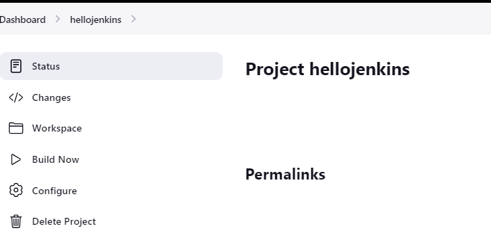
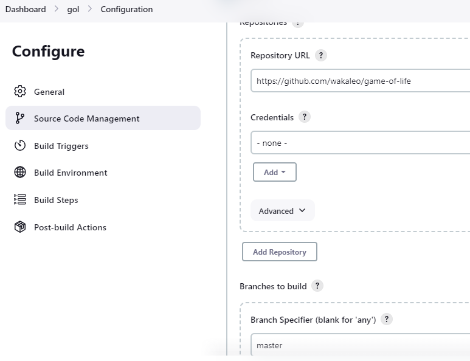
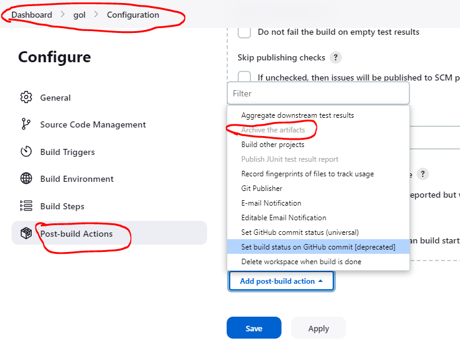

## Normal workflow for application deployments in Organisations

* There are 3 major workflow's in which projects fit-in :

    1. Virtual/Physical machine Deployment
    2. Infra Provisioning and Deployment
    3. Containerized Deployment

=>  Aplications are deployed on :

   1. Virtual machine/Physical machine :
         * OnPrem
         * Cloud
   2. Containers :
         * Docker
         * Kubernetes-k8s (OnPrem/Cloud)
   3. Cloud Native Applications :
        * PaaS (Azure-App Service/AWS-Elastic BeanStalk)
        * FaaS (Azure-Functions/AWS-Lamda)      

## Our working with the pipelines

=> Step's we follow for any type (.net, java, sap) of application :

* Build the code
* Getting the package
* Creating an environment or deploying application into a existing service
* To automate this flow we use Jenkins

## Deployment options we choose

* In real every CI/CD tool is a CRON Job ( Scheduler ) on steroids ( can work over the failed cases also )

    * PaaS - Platform as a Service
    * IaaS - Infrastructure as a Service
    * SaaS - Software as a Service

## Proceeding with Jenkins

* Learning GIT ( Version Control System ) - Taking latest version of the code
* Sonar Qube ( Static Code Analysis ) - check for code written as per standards or not
* Jfrog/Artifactory ( Artifact Repository) - supports all the languages like storing java packages,linux packages,.net packages,Docker packages,etc - they also have artifactory scan features too
* Maven, MsBuild ( build java,.net applications) - to understand certain terms,dependencies,packaging phase,compiling phase

* Pipelines ( creating pipelines for applications) - two types
  1. UI oriented - Free style
  2. Pipeline as code - Declarative pipelines

* Administrative features :
  1. Backup
  2. Plugins
  3. User Management
  4. Multi nodes

## Maven installation 

* For java projects to work we need maven and java jdk to be present.
* Maven requires Java to be installed.

=> Distributions:
     * OpenJDK
     * Oracle JDK
     * IBM JDK
     * Amazon Corretto JDK

=> Versions:
     * 8
     * 11
     * 17
     * 19

=> Environmental Variables:
   * PATH : defines the which folder to be referred when a command is given (/usr/local/sbin:/usr/local/bin:/usr/sbin:/usr/bin:/sbin:/bin:/usr/games:/usr/local/games:/snap/bin)
   * JAVA_HOME : Directory where java gets installed (/usr/lib/jvm/java-8-openjdk-amd64)
   * M2_HOME : Directory where maven gets installed

[ We do these installations over Linux machine ]

## Java Installation
   ( openjdk-8 version)

=> Installation steps :

=> To add our own Environmental variables :

  1. For all the environments : vi /etc/environment

  2. For only our user : vi ~./bash

## Maven Installation

=> Installation steps :

## Sample : Building Game of life using maven
           ( This requires jdk-8 )

* Game of life repo : https://github.com/wakaleo/game-of-life

* To validate the pom.xml files created - 'mvn validate'

=> Commands to proceed through the workflow (life-cycle) : 

* Compile the code: 'mvn compile'

* Run the automated tests: 'mvn test'

* Create the package: 'mvn package'

=> History of all commands used :

## Sample : Building Spring-pet clinic using maven
       ( This requires jdk-17 )

* Setting variables and generating java-17

* Here if we want to permanently change the variables and path we go into bashrc and set the values
* Instead we can set temporarily using export command and setting variables and path for java-17 (as required)

* Spring-pet clinic repo : https://github.com/spring-projects/spring-petclinic

=> Commands to proceed through the workflow : 

* Compile the code: 'mvn compile'
* Run the automated tests: 'mvn test'
* Create the package: 'mvn package'

=>  Maven will download all the necessary dependencies to compile/package/test from a maven central repository ( https://mvnrepository.com/repos/central ) 

=> It downloads to M2_HOME which is by default '< HOME-DIR >/.m2' which is referred as local repository

## Maven Lifecycle Phases

    * Compile : Creates .class files
    * Test: Runs unit tests
    * Package: Create packages (jar/war)
    * Install: Copies the project which you have build to the local repository
 => Along with jar/war files as pom also gets copied

 # Jenkins

* Jenkins is an open source CI/CD Engine.
* Jenkins can be installed in following ways:
  * Using Package managers on Linux
  * Docker
  * Windows
  * WAR
* Official website for jenkins installation (here we can choose the method for installation) : https://www.jenkins.io/doc/book/installing/
* we would rather install LTS (Long Term Support Version) 
* For now we let's do it on ubuntu amchine : 

## Installing Steps for Jenkins :

=> For installing Jenkins we need to have java first ( openjdk-11-jdk)
* sudo apt update
* sudo apt install openjdk-11-jdk -y

[ From jenkins website installing steps ]
* curl -fsSL https://pkg.jenkins.io/debian-stable/jenkins.io-2023.key | sudo tee \
  /usr/share/keyrings/jenkins-keyring.asc > /dev/null
* echo deb [signed-by=/usr/share/keyrings/jenkins-keyring.asc] \
  https://pkg.jenkins.io/debian-stable binary/ | sudo tee \
  /etc/apt/sources.list.d/jenkins.list > /dev/null
* sudo apt-get update
* sudo apt-get install jenkins -y

* After installing jenkins a user jenkins got created with

=> '/var/lib/jenkins' as Home directory

=> /bin/bash as default shell

* Also check if the user jenkins is created or not using ' cat /etc/passwd '

* Check for status of Jenkins :
  sudo systemctl start jenkins
  sudo systemctl status jenkins

* Now exposing it externally using < http://< Public_IP >:8080 > :

* After installing the suggested pluggins, create a admin user :

user : jenkinsuser
pass : jenkinsuser

* Jenkins homepage :

## Jenkins Projects

* They are of 3 types (majorly) : 
     1. Free Style: These projects are UI Based.
     2. Scripted Pipeline
     3. Declarative Pipeline

## Sample : Setting up a project (Job) to display system information )

* Lets create a Jenkins project which displays
  1. username
  2. current working directory
  3. all the environmental variables

* Lets start by create a Jenkins project (Freestyle), by clicking on 'New item'

* Now navigate to 'Build Steps' and select 'Execute shell'

* Now change the invoke shell steps to something as shown below

* Build the jenkins job

* Click on 'Build Now'

* Now select the console output

## Let also see a failure scenerio

* Edit the commands in the 'Build Steps' - shell prompt

* After changing and building again we get 

## Sample : Creating a project to run spring-pet clinic

* Manual steps : 
    * git clone https://github.com/spring-projects/spring-petclinic.git
    * cd spring-petclinic
    * mvn package
=> Doesn't get exposed over the browser

* Create a Jenkins job with name spc and in build steps invoke shell and execute
    * Complete installation of java-11 and jenkins on an ubuntu machine

* Install maven 

* Now rerun the same job

[spring-pet clinic doesn't work manually nor over jenkins job]

## Sample : Creating a project to run Game-of-life

* we install jenkins along with both java-8 (for Game-of-life)and java-17 (for java to be present)

* Complete installing jenkins

* Start working creating project and the Shell Script to be given is :

  *  export PATH="/usr/lib/jvm/java-1.8.0-openjdk-amd64/bin:$PATH"
  * java -version
  * mvn --version
  * git clone https://github.com/wakaleo/game-of-life
  * cd game-of-life
  * mvn package

* Proceed and check  for the output :

## Create a new project for Game-of-life (over the UI selection options instead of the manual steps)

* Install jenkins on an ubuntu machine along with java-8 and java-17

* Setting different java or other tools

=> On the jenkins dashboard

Manage Jenkins => Tools => JDK => Add JDK

* Add any no.of versions that we need

=> give the name and home directory for java-17 and java-8 (using the export command on UI)

* Install maven 'sudo apt install maven -y' and check with the version

=> On the jenkins dashboard

Manage Jenkins => Tools => Maven => Add Maven

* Create a freestyle project to build game-of-life

=> On the jenkins dashboard

New item => gol => freestyle project => ok

## Exploring the options on dashboard

* General :-> general information about build project

* Source code management :-> about the version control information of the project

=> Add the REPO-URL and BRANCH-NAME and save

[only when Git is the public repo for opensource project,credentials are given for any other private repo for any project]

* As a root user ,Swith to jenkins user,go to home directory of jenkins 'JENKINS_HOME : var/lib/jenkins'

=> Every detail we mention in UI gets stored into config.xml file 'cat jobs/< project-name >/config.xml'

[No two projects can have same name]

=> Now build the project and let's explore workspace

=> Go back to gol => configure => Build steps => shell ( pwd ) => save

* Build Triggers : when to build - job to be called

* Build Environment : what to be built in the project

* Build steps : what to be done before building the project (there are many options)

* Post Build Actions : what to be done after build in the project

=> Sending email,
=> Setting GitHub status, etc

* Let's build game-of-life

=> General => JAVA_8_UBUNTU 

=> Source code management => git-url of gol

=> Build Environment => Delete workspace

=> Build steps => invoke top-level maven => package => save

=> Build now

[ If the working is delayed, we can resize the machine only after stopping the machine and restarting it again ]

 * To backup or preserve data of the project
 => we take the backup of '/var/lib/jenkins' folder frequently

* When we run the project we also get unit test results

=> Dashboard => click on the project

* Let's further configure some sections

=> Configue => Post build Actoins => Publish Junit test result report

=> For test report xml '**/surefire-reports/TEST-*.xml' 

=> Build now => console output

=> To show the results and artifact made directly

=>Dashboard => gol => Configure => Post-build Actions -> Archive the artifacts 

-> Files to archive - '**/target/gameoflife.war'

=> Save => build now

[After every change you make inorder to get the results, we need to build again and again]

## Plug-In in Jenkins

* It is an additional functionality provided , which will add functionality to Jenkins not to the machine(Virtual Machines) which we run 
( not an installation on the 'Jenkins master node' )

=> Dashboard => Manage Jenkins => Plugins => Installed plugins
=> Available plugins => search for the required plugins

## Build Excecutors (Build Executor Status)

* on Jenkins node determines how many projects can be built parallely

* An individual project by default gets only one executor, if you want to change this (not a good idea), we can give the no.of builds we want 

=> Every node in Jenkins can be configured with no.of executors
=> Manage Jenkins => Nodes and Clouds => Built-in Node -> Configure -> Put no.of executors you require

[Defulat case (may not be true for every job,some need two cpu's instead): generally for every virtual CPU a job is assigned and run]

## Distributed Builds

* Jenkins has 2 types of nodes :
     1. Master node : On which we install jenkins
     2. Node : On which we run the job which matches the label definition
* Here, Jenkins distributes the job based on the label or os used

* Adding more nodes increases no.of executors which means we can build more projects
* And to make Jenkins highly vailable also we increase the no.of master nodes those share a same folder 'var/lib/jenkins' we store the behaviour of that node
* So if even one server goes down the other is stayed as backup with doing the same work 

## Let's add a node(linux-ubuntu) to the master node

* Create two vm's with same configurations
* Install Java and Jenkins on the master node

##  Multi node configuration

* Create two vm's with basic configuration and name them as master and Node

* Install java-17 and jenkins on Master & Install java-8, java-17 and maven on the Node

* login into Jekins and create credentials

=> Manage Jenkins => Credentials

=> global => Add credentials

=> Start adding credentials

* Now to add the key, copy the key content from terminal and add into the section along with begin and end & create

* It's created

=> Dashboard => Manage Jenkins => Nodes and clouds => New Node

* Copy the IP address of the node for host ( Private IP also works if both master and node in same network) and save

* Wait and check for node is launched by clicking on node and logs => Launch agent (keep node machine also connected)
* Now configure Game of life
* Add jdk-8 and jdk-17 and save 
* Create a freestyle project gol and ok
* Configure for project gol
* JDk-8 , now restrict project to run with label as given with Node 'MAVEN_JDK-8' and give 'github url' with branch name as 'Master'
* Give the build steps with goal-package and in post build actions- archive the artifacts '**/gameoflife.war'
* Publish Junit result '**/target/surefire-reports/TEST-*.xml' an save
=> dashboard => |> symbol to build
* You get the archive built

## Jenkins-2 ( Pipeline as Code )

* Pipeline as a code refers to creating CI/CD Pipeline in some file format and version control (generally closer to code)

* Jenkins 1 was predominantly UI oriented, where as in Jenkins 2 the concept of pipelines were introduced natively.

* Now we write our build steps in these pipelines and then version control.

* Jenkins has created 2 types of pipelines

    1. Scripted Pipeline:
        * This pipeline allows to use Groovy Language directly
        * This is a different approach
    2. Declarative Pipeline
        * This pipeline internally uses Groovy but we use Jenkins DSL (Domain Specific Language)
        * Similar for the benifit of classic jenkins users

## Groovy

* There are two popular Java Based Languages
    1. Scala (Big Data Purposes)
    2. Groovy (Scripting purposes)

## Build Gameoflife on node1 using Scripted pipeline (sp)

* Create a new project gol-sp of pipeline type

=> Configure => pipeline => wirte the below pipeline => Save

[ In order to get help with the pipeline to write , click on pipeline syntax below and generate the code required]

------- Jenkins file

node('MAVEN_JDK8')
{
    stage('vcs')
    {
        git 'https://github.com/wakaleo/game-of-life.git'
    }
    stage('build') 
    {
        sh 'export PATH="/usr/lib/jvm/java-1.8.0-openjdk-amd64/bin:$PATH" && mvn package'

    }
    stage('postbuild')
    {
        archiveArtifacts artifacts: '**/target/gameoflife.war', followSymlinks: false
        junit '**/surefire-reports/TEST-*.xml'
    }
}
-------
=> Dashboard => build symbol at  the project => Stage view / Console output
=> Build now

## Build Gameoflife on node1 using Declarative pipeline (dp)

* Create a new project gol-dp of pipeline type

=> Configure => pipeline => wirte the below pipeline => Save

[ In order to get help with the pipeline to write , click on pipeline syntax below and generate the code required]

------- Jenkins file

pipeline {
    agent { label 'MAVEN_JDK8' }
    stages {
        stage('VCS') {
            steps {
                git 'https://github.com/wakaleo/game-of-life.git'
            }
        }
        stage('build') {
            steps {
                sh 'export PATH="/usr/lib/jvm/java-1.8.0-openjdk-amd64/bin:$PATH" && mvn package'
            }
        }
    }

}

-------
=> Dashboard => build symbol at  the project => Stage view / Console output
=> Build now

## Pipeline as Code (PAC)

* Pipeline as a code allows us to define CI/CD in a text document in any version control system

* CI/CD Pipeline when expressed as PAC will be present in git.

* Jenkins has started supporting Pipelines with
    1. Scripted Pipelines
    2. Declartive Pipelines

### Scripted Pipelines

* A pipeline can be defined in any file but 'Jenkins file' is most widely used name.

* The structure of Pipeline in scripted is as shown below

* Jenkins will have a set of steps which will be part of default jenkins installation and rest of steps can be added to jenkins by installing plugins

* Jenkins Pipeline steps reference : https://www.jenkins.io/doc/pipeline/steps/

## Sample : scripted pipeline for game of life

* let's create a directory And clone the code from git into it 'git clone < project_url >'
=> Clone the code using git pipeline : https://www.jenkins.io/doc/pipeline/steps/git/#git-git

* Create a branch 'git checkout -b < branch-name >'
=> Switched to the new branch

* Open code ' code .' to write a pipeline
=> Create a file 'Jenkins-file'

* Jenkins-file
----------------
node('MAVEN_JDK8') {
    stage('version control') {
        git url: 'https://github.com/khajadevopsmarch23/game-of-life.git',
            branch: 'scripted'
    }
}
--------------------
* Make your Jenkins node up and add 'git add .' , commit 'git commit -m "Added changes"' , push 'git push origin < Branch-name >' 

* Create a New item/view 
=> Name => List view => Create => Apply => ok

* In new project
=> New item => Name => pipeline => ok
=> Pipeline => Select- script from SCM => git => repo url (git url) => branch (created branch name) => Save => Build now

* Go to dashboard and check for working - stage view

* Now to build the package
* Jenkins-file
-------------------------------
        git url: 'https://github.com/khajadevopsmarch23/game-of-life.git',
            branch: 'scripted'
    }
    stage('build the code') {
        sh 'export PATH="/usr/lib/jvm/java-1.8.0-openjdk-amd64/bin:$PATH" && mvn package'
    }
    stage('archive the artifacts') {
        archiveArtifacts onlyIfSuccessful: true,
            artifacts: '**/target/gameoflife.war',
            allowEmptyArchive: false
    }
    stage('show the test results') {
        junit testResults: '**/surefire-reports/TEST-*.xml',
              allowEmptyResults: true
    }
}
------------------------------------
(March 3 2023)

## Declarative Pipelines

* Jenkins has a DSL (Domain Specific Language) for creating Declarative Pipeines

* Jenkins Pipeline Syntax : https://www.jenkins.io/doc/book/pipeline/syntax/#declarative-pipeline

* 