## Normal workflow for application deployments in Organisations

* There are 3 major workflow's in which projects fit-in :

   1. Virtual/Physical machine Deployment
   2. Infra Provisioning and Deployment
   3. Containerized Deployment

=>  Aplications are deployed on :

   1. Virtual machine/Physical machine :
         * OnPrem
         * Cloud
   2. Containers :
         * Docker
         * Kubernetes-k8s (OnPrem/Cloud)
   3. Cloud Native Applications :
        * PaaS (Azure-App Service/AWS-Elastic BeanStalk)
        * FaaS (Azure-Functions/AWS-Lamda)      

## Our Performing in the pipelines

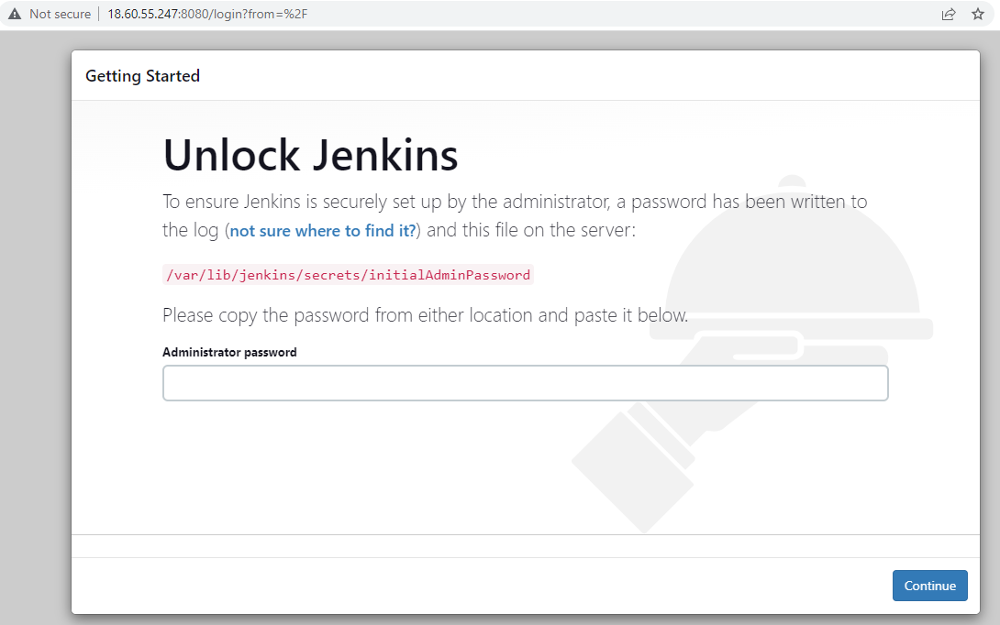

=> Step's we follow for any type(.net,java,sap) of application :

* Build the code
* Getting the package
* Creating an environment or deploying application into a existing service
* To automate this flow we use Jenkins

## Deployment options we choose

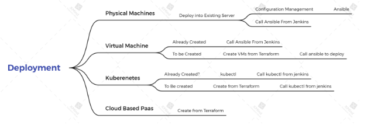

* In real every CI/CD tool is a CRON Job ( Scheduler ) on steroids ( can work over the failed cases also )

    * PaaS - Platform as a Service
    * IaaS - Infrastructure as a Service
    * SaaS - Software as a Service

## Proceeding with Jenkins

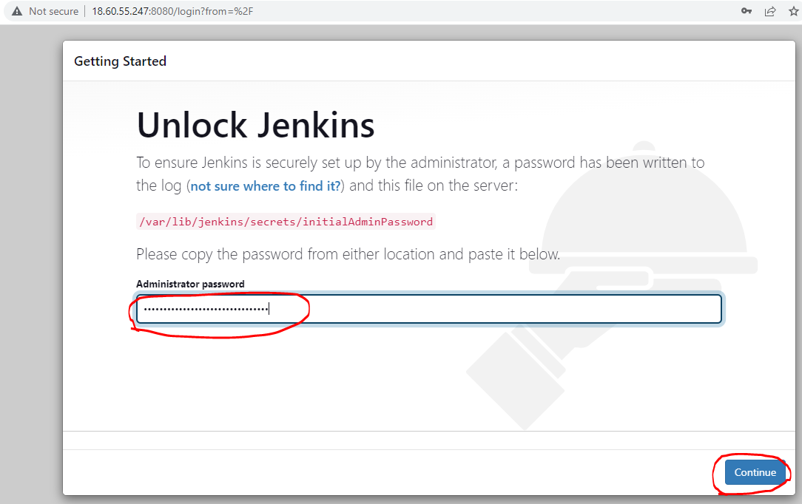

* Learning GIT ( Version Control System ) - Taking latest version of the code
* Sonar Qube ( Static Code Analysis ) - check for code written as per standards or not
* Jfrog/Artifactory ( Artifact Repository) - supports all the languages like storing java packages,linux packages,.net packages,Docker packages,etc - they also have artifactory scan features too
* Maven, MsBuild ( build java,.net applications) - to understand certain terms,dependencies,packaging phase,compiling phase

* Pipelines ( creating pipelines for applications) - two types
  1. UI oriented - Free style
  2. Pipeline as code - Declarative pipelines

* Administrative features :
  1. Backup
  2. Plugins
  3. User Management
  4. Multi nodes

  ## Maven installation 

  * For java projects to work we need maven and java jdk to be present.
  Maven requires Java to be installed.

=> Distributions:
    * OpenJDK
    * Oracle JDK
    * IBM JDK
    * Amazon Corretto JDK

=> Versions:
    * 8
    * 11
    * 17
    * 19

=> Environmental Variables:
   * PATH : defines the which folder to be referred when a command is given (/usr/local/sbin:/usr/local/bin:/usr/sbin:/usr/bin:/sbin:/bin:/usr/games:/usr/local/games:/snap/bin)
   * JAVA_HOME : Directory where java gets installed (/usr/lib/jvm/java-8-openjdk-amd64)
   * M2_HOME : Directory where maven gets installed

* We do these installations over Linux machine

## Java Installation
   ( openjdk-8 version)

=> Installation steps :

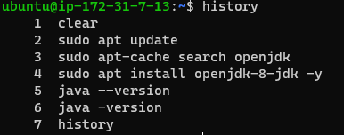

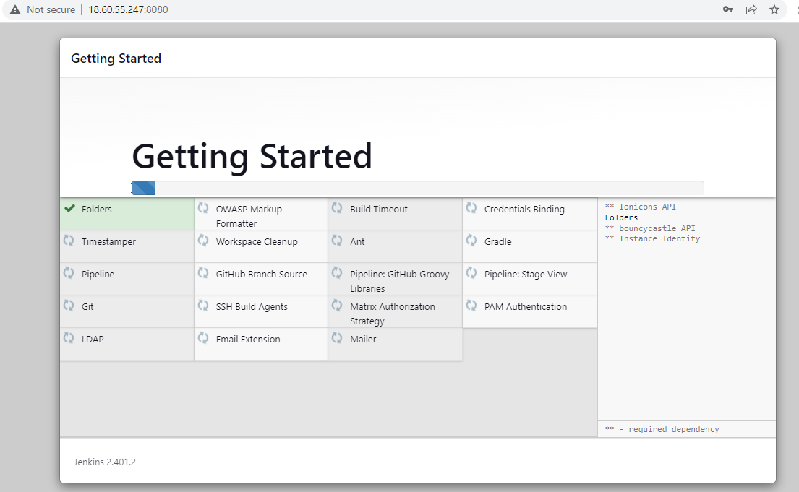

=> To add our own Environmental variables :

  1. For all the environments : vi /etc/environment

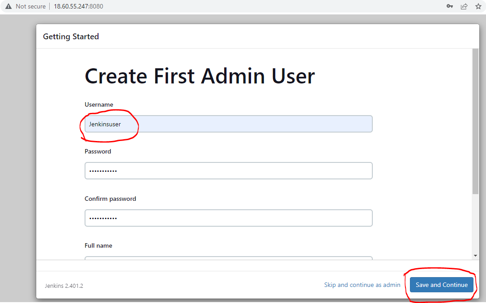

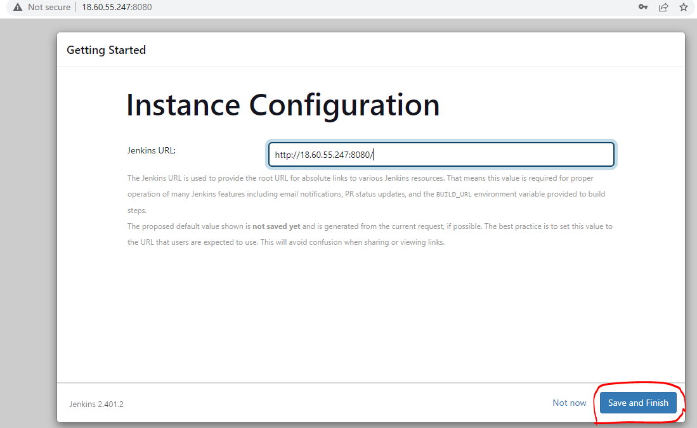

  2. For only our user : vi ~./bash

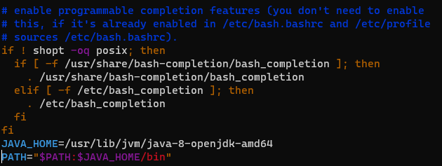

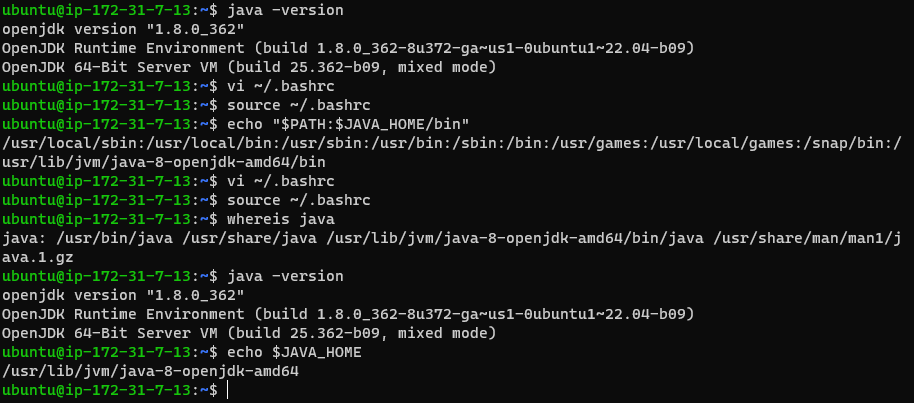

## Maven Installation

=> Installation steps :

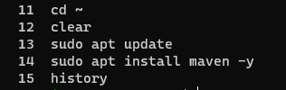

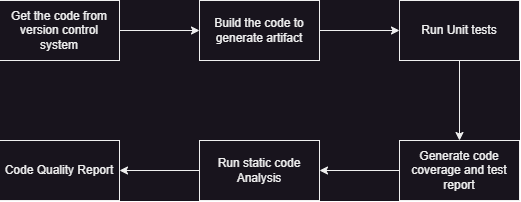

## Sample : Building Game of life using maven
           ( This requires jdk-8 )

* Game of life repo : https://github.com/wakaleo/game-of-life

* To validate the pom.xml files created - 'mvn validate'

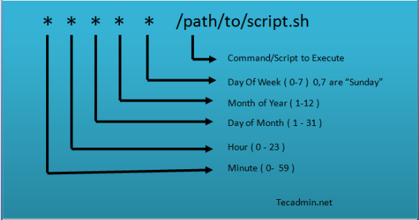
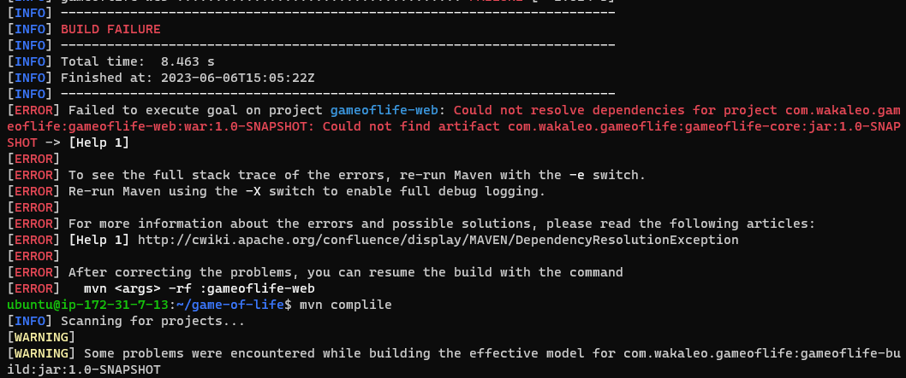

=> Commands to proceed through the workflow (life-cycle) : 

* Compile the code: 'mvn compile'

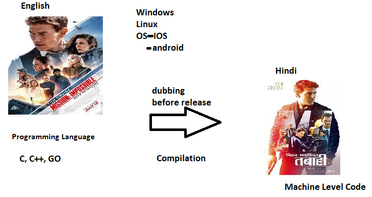
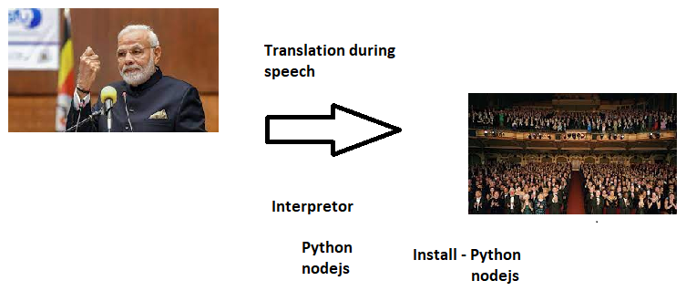

* Run the automated tests: 'mvn test'

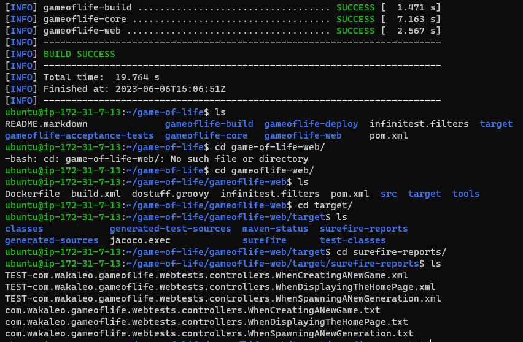
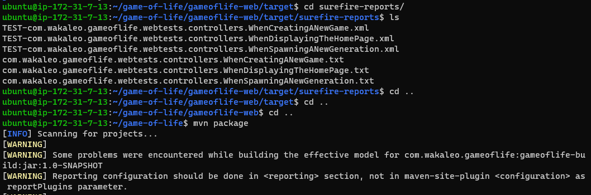
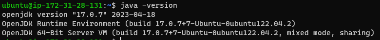

* Create the package: 'mvn package'

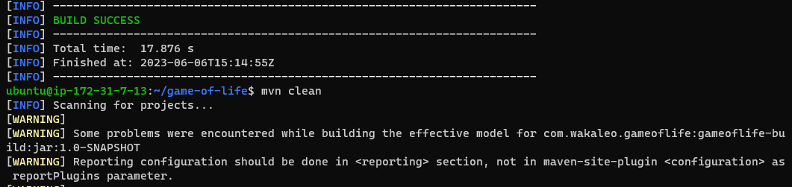
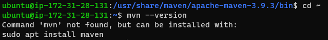
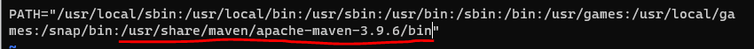

=> History of all commands used :

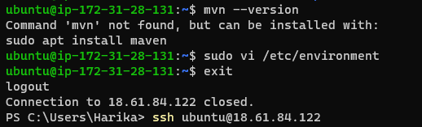

## Sample : Building Spring-pet clinic using maven
       ( This requires jdk-17 )

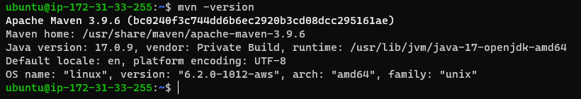
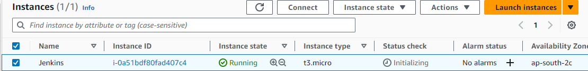

* Setting variables and generating java-17

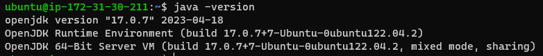
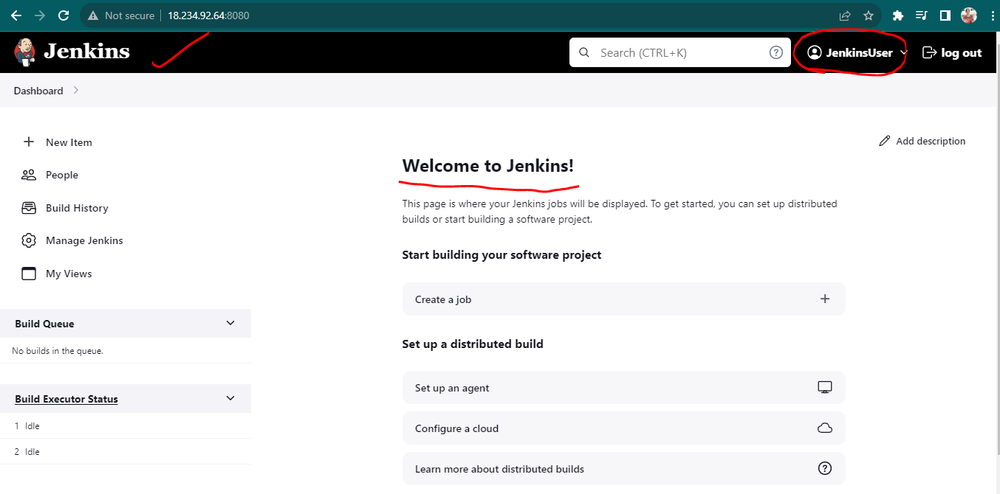

* Here if we want to permanently change the variables and path we go into bashrc and set the values
* Instead we can set temporarily using export command and setting variables and path for java-17 (as required)

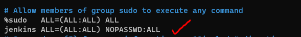

* Spring-pet clinic repo : https://github.com/spring-projects/spring-petclinic

Commands to proceed through the workflow : 

* Compile the code: 'mvn compile'
* Run the automated tests: 'mvn test'
* Create the package: 'mvn package'

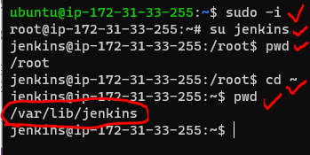

=>  Maven will download all the necessary dependencies to compile/package/test from a maven central repository ( https://mvnrepository.com/repos/central ) 

=> It downloads to M2_HOME which is by default '< HOME-DIR >/.m2' which is referred as local repository

## Maven Lifecycle Phases

    * Compile : Creates .class files
    * Test: Runs unit tests
    * Package: Create packages (jar/war)
    * Install: Copies the project which you have build to the local repository
 => Along with jar/war files as pom also gets copied

 # Jenkins

* Jenkins is an open source CI/CD Engine.
* Jenkins can be installed in following ways:
  * Using Package managers on Linux
  * Docker
  * Windows
  * WAR
* Official website for jenkins installation (here we can choose the method for installation) : https://www.jenkins.io/doc/book/installing/
* we would rather install LTS (Long Term Support Version) 
* For now we let's do it on ubuntu amchine : 

Installing Steps for Jenkins :

=> For installing Jenkins we need to have java first ( openjdk-11-jdk)
* sudo apt update
* sudo apt install openjdk-11-jdk -y

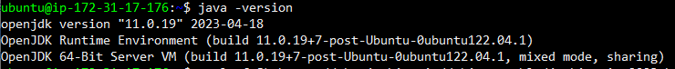

[ From jenkins website installing steps ]
* curl -fsSL https://pkg.jenkins.io/debian-stable/jenkins.io-2023.key | sudo tee \
  /usr/share/keyrings/jenkins-keyring.asc > /dev/null
* echo deb [signed-by=/usr/share/keyrings/jenkins-keyring.asc] \
  https://pkg.jenkins.io/debian-stable binary/ | sudo tee \
  /etc/apt/sources.list.d/jenkins.list > /dev/null
* sudo apt-get update
* sudo apt-get install jenkins -y

* Also check if the user jenkins is created or not using ' cat /etc/passwd '

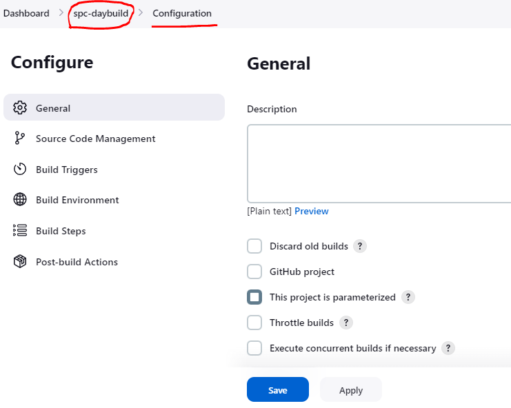

* Check for status of Jenkins :

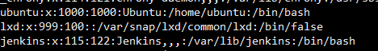
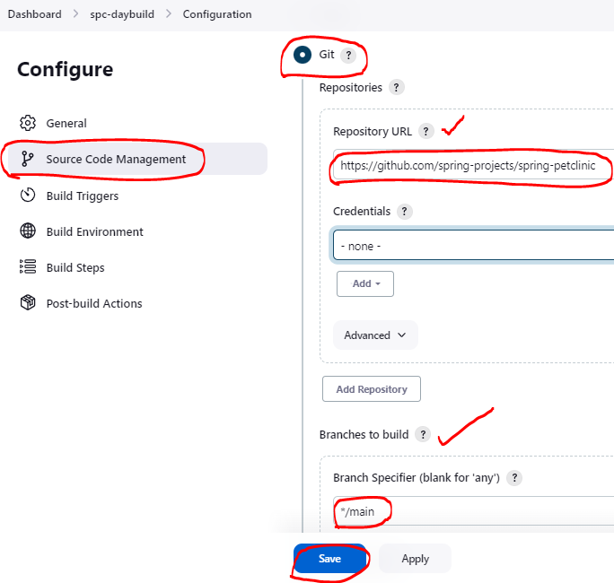

* Now exposing it over browser using < Public_IP:8080 > :

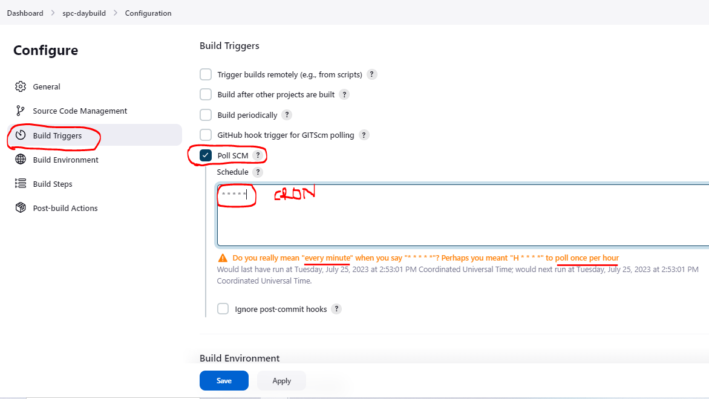
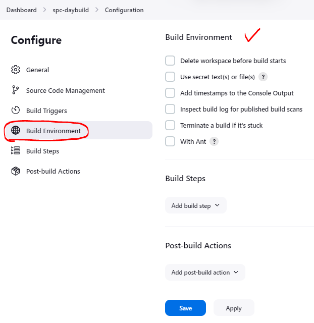

* After installing the suggested pluggins, create a admin user :

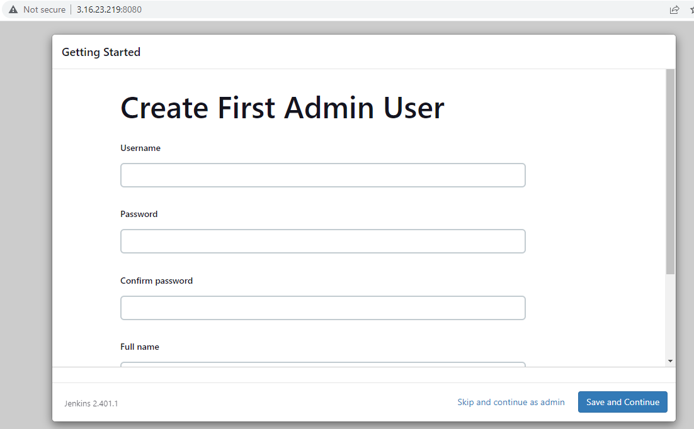
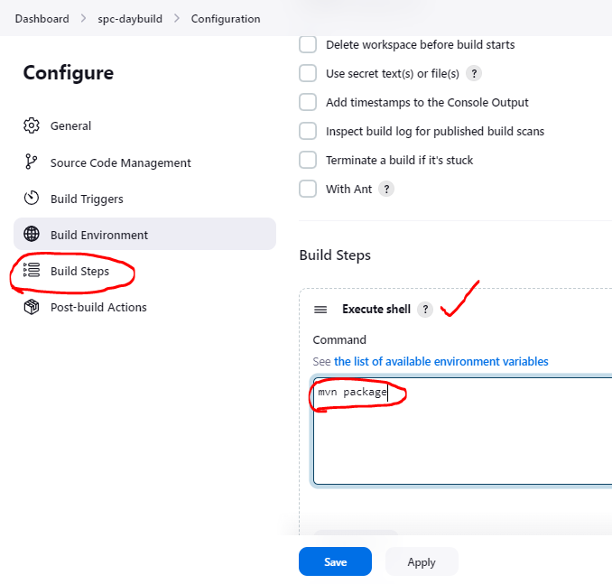

user : jenkinsuser
pass : jenkinsuser

* Jenkins homepage :

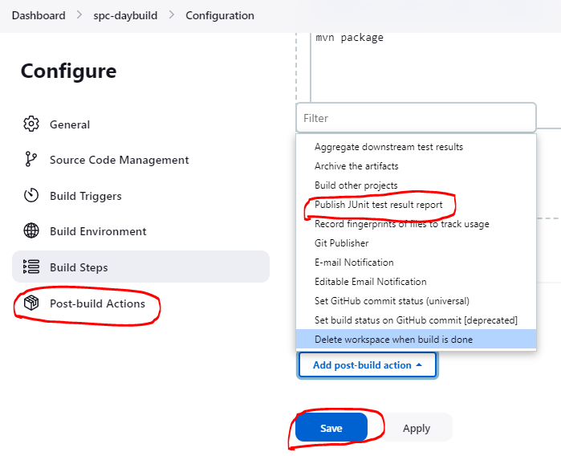
