## Normal workflow for application deployments in Organisations

* There are 3 major workflow's in which projects fit-in :

    1. Virtual/Physical machine Deployment
    2. Infra Provisioning and Deployment
    3. Containerized Deployment

=>  Aplications are deployed on :

   1. Virtual machine/Physical machine :
         * OnPrem
         * Cloud
   2. Containers :
         * Docker
         * Kubernetes-k8s (OnPrem/Cloud)
   3. Cloud Native Applications :
        * PaaS (Azure-App Service/AWS-Elastic BeanStalk)
        * FaaS (Azure-Functions/AWS-Lamda)      

## Our working with the pipelines

=> Step's we follow for any type (.net, java, sap) of application :

* Build the code
* Getting the package
* Creating an environment or deploying application into a existing service
* To automate this flow we use Jenkins

## Deployment options we choose

* In real every CI/CD tool is a CRON Job ( Scheduler ) on steroids ( can work over the failed cases also )

    * PaaS - Platform as a Service
    * IaaS - Infrastructure as a Service
    * SaaS - Software as a Service

## Proceeding with Jenkins

* Learning GIT ( Version Control System ) - Taking latest version of the code
* Sonar Qube ( Static Code Analysis ) - check for code written as per standards or not
* Jfrog/Artifactory ( Artifact Repository) - supports all the languages like storing java packages,linux packages,.net packages,Docker packages,etc - they also have artifactory scan features too
* Maven, MsBuild ( build java,.net applications) - to understand certain terms,dependencies,packaging phase,compiling phase

* Pipelines ( creating pipelines for applications) - two types
  1. UI oriented - Free style
  2. Pipeline as code - Declarative pipelines

* Administrative features :
  1. Backup
  2. Plugins
  3. User Management
  4. Multi nodes

## Maven installation 

* For java projects to work we need maven and java jdk to be present.
* Maven requires Java to be installed.

=> Distributions:
     * OpenJDK
     * Oracle JDK
     * IBM JDK
     * Amazon Corretto JDK

=> Versions:
     * 8
     * 11
     * 17
     * 19

=> Environmental Variables:
   * PATH : defines the which folder to be referred when a command is given (/usr/local/sbin:/usr/local/bin:/usr/sbin:/usr/bin:/sbin:/bin:/usr/games:/usr/local/games:/snap/bin)
   * JAVA_HOME : Directory where java gets installed (/usr/lib/jvm/java-8-openjdk-amd64)
   * M2_HOME : Directory where maven gets installed

[ We do these installations over Linux machine ]

## Java Installation
   ( openjdk-8 version)

=> Installation steps :

=> To add our own Environmental variables :

  1. For all the environments : vi /etc/environment

  2. For only our user : vi ~./bash

## Maven Installation

=> Installation steps :

## Sample : Building Game of life using maven
           ( This requires jdk-8 )

* Game of life repo : https://github.com/wakaleo/game-of-life

* To validate the pom.xml files created - 'mvn validate'

=> Commands to proceed through the workflow (life-cycle) : 

* Compile the code: 'mvn compile'

* Run the automated tests: 'mvn test'

* Create the package: 'mvn package'

=> History of all commands used :

## Sample : Building Spring-pet clinic using maven
       ( This requires jdk-17 )

* Setting variables and generating java-17

* Here if we want to permanently change the variables and path we go into bashrc and set the values
* Instead we can set temporarily using export command and setting variables and path for java-17 (as required)

* Spring-pet clinic repo : https://github.com/spring-projects/spring-petclinic

=> Commands to proceed through the workflow : 

* Compile the code: 'mvn compile'
* Run the automated tests: 'mvn test'
* Create the package: 'mvn package'

=>  Maven will download all the necessary dependencies to compile/package/test from a maven central repository ( https://mvnrepository.com/repos/central ) 

=> It downloads to M2_HOME which is by default '< HOME-DIR >/.m2' which is referred as local repository

## Maven Lifecycle Phases

    * Compile : Creates .class files
    * Test: Runs unit tests
    * Package: Create packages (jar/war)
    * Install: Copies the project which you have build to the local repository
 => Along with jar/war files as pom also gets copied

 # Jenkins

* Jenkins is an open source CI/CD Engine.
* Jenkins can be installed in following ways:
  * Using Package managers on Linux
  * Docker
  * Windows
  * WAR
* Official website for jenkins installation (here we can choose the method for installation) : https://www.jenkins.io/doc/book/installing/
* we would rather install LTS (Long Term Support Version) 
* For now we let's do it on ubuntu amchine : 

## Installing Steps for Jenkins :

=> For installing Jenkins we need to have java first ( openjdk-11-jdk)
* sudo apt update
* sudo apt install openjdk-11-jdk -y

[ From jenkins website installing steps ]
* curl -fsSL https://pkg.jenkins.io/debian-stable/jenkins.io-2023.key | sudo tee \
  /usr/share/keyrings/jenkins-keyring.asc > /dev/null
* echo deb [signed-by=/usr/share/keyrings/jenkins-keyring.asc] \
  https://pkg.jenkins.io/debian-stable binary/ | sudo tee \
  /etc/apt/sources.list.d/jenkins.list > /dev/null
* sudo apt-get update
* sudo apt-get install jenkins -y

* After installing jenkins a user jenkins got created with

=> '/var/lib/jenkins' as Home directory

=> /bin/bash as default shell

* Also check if the user jenkins is created or not using ' cat /etc/passwd '

* Check for status of Jenkins :
  sudo systemctl start jenkins
  sudo systemctl status jenkins

* Now exposing it externally using < http://< Public_IP >:8080 > :

* After installing the suggested pluggins, create a admin user :

user : jenkinsuser
pass : jenkinsuser

* Jenkins homepage :

## Jenkins Projects

* They are of 3 types (majorly) : 
     1. Free Style: These projects are UI Based.
     2. Scripted Pipeline
     3. Declarative Pipeline

## Sample : Setting up a project (Job) to display system information )

* Lets create a Jenkins project which displays
  1. username
  2. current working directory
  3. all the environmental variables

* Lets start by create a Jenkins project (Freestyle), by clicking on 'New item'

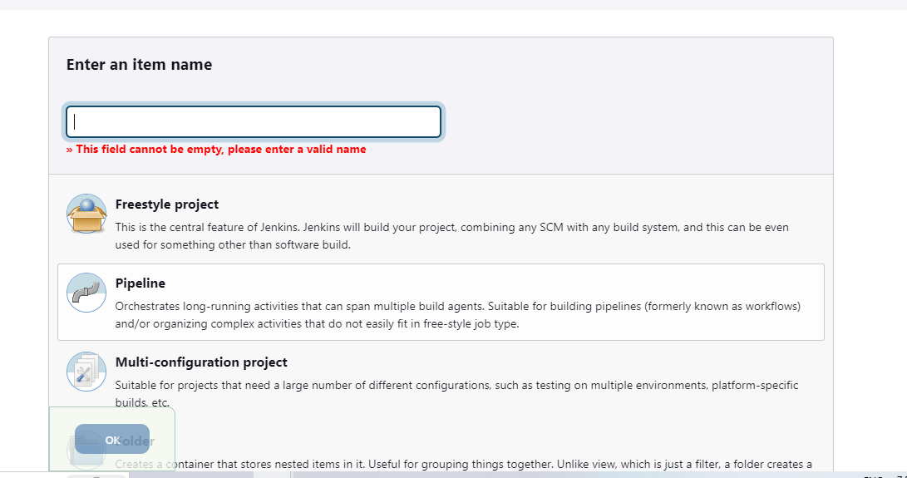

* Now navigate to 'Build Steps' and select 'Execute shell'

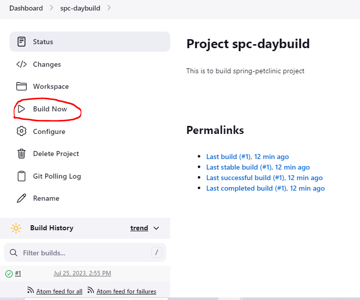

* Now change the invoke shell steps to something as shown below

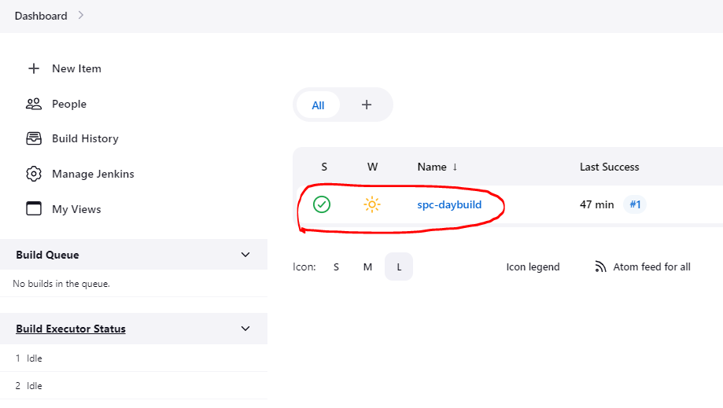

* Build the jenkins job

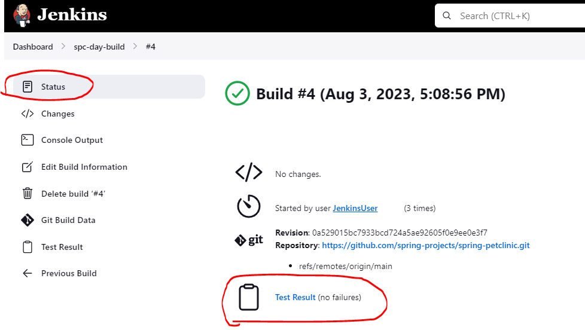

* Click on 'Build Now'

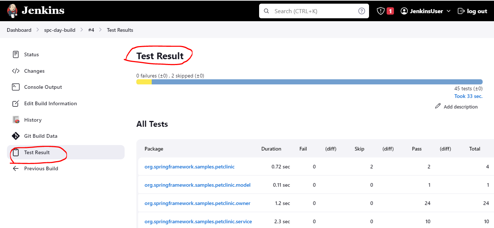
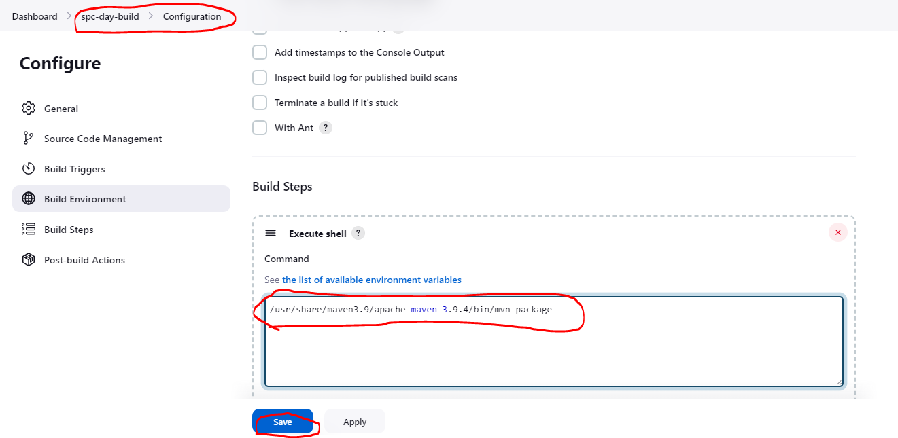

* Now select the console output

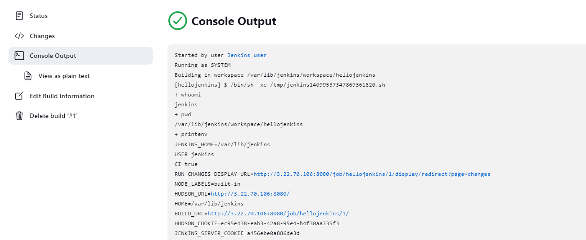

## Let also see a failure scenerio

* Edit the commands in the 'Build Steps' - shell prompt

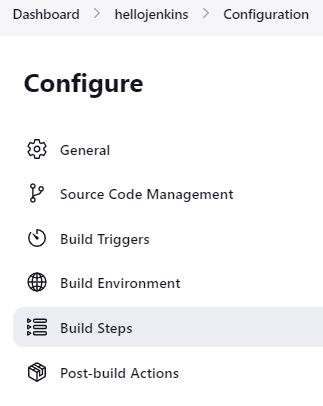
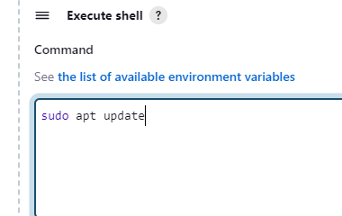

* After changing and building again we get 

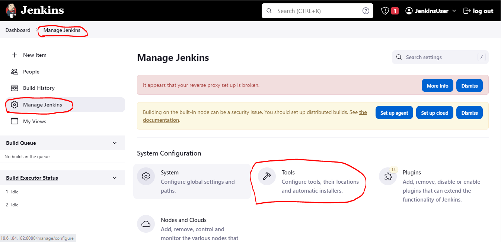
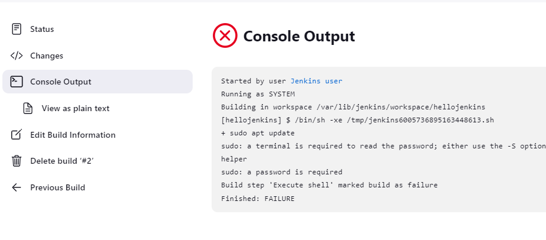

## Sample : Creating a project to run spring-pet clinic

* Manual steps : 
    * git clone https://github.com/spring-projects/spring-petclinic.git
    * cd spring-petclinic
    * mvn package
=> Doesn't get exposed over the browser

* Create a Jenkins job with name spc and in build steps invoke shell and execute
    * Complete installation of java-11 and jenkins on an ubuntu machine

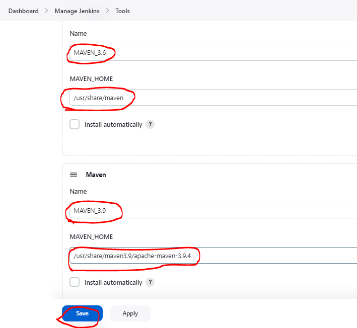
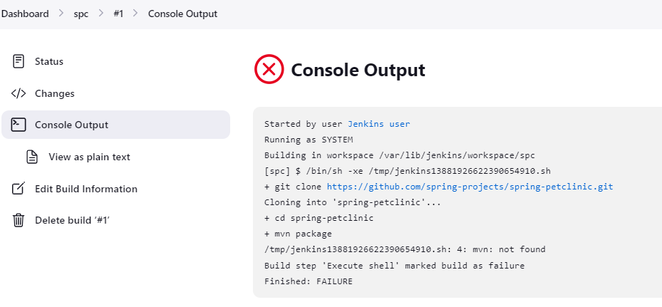

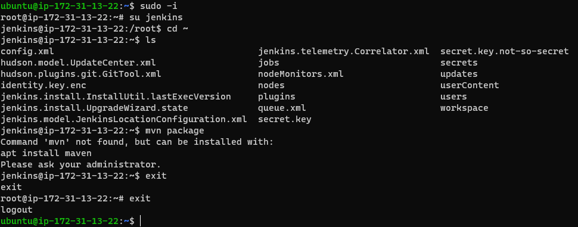

* Install maven 

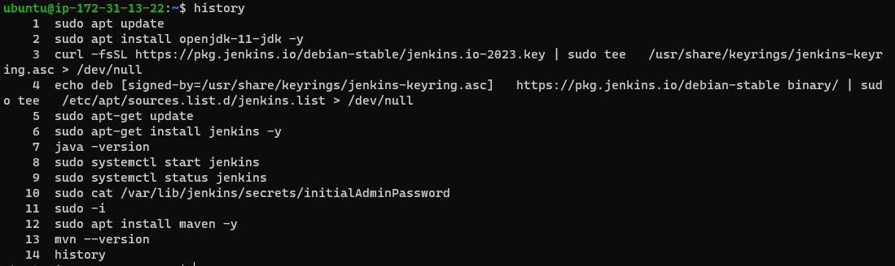
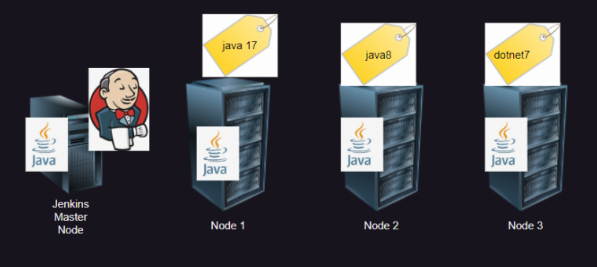
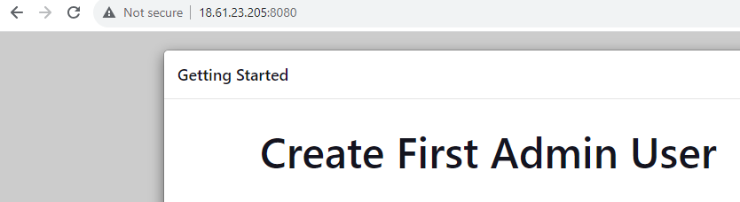

* Now rerun the same job

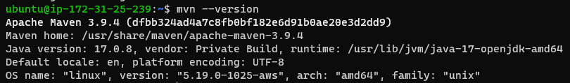

[spring-pet clinic doesn't work manually nor over jenkins job]

## Sample : Creating a project to run Game-of-life

* we install both java-8 (Game-of-life)and java-17 (java to be present)

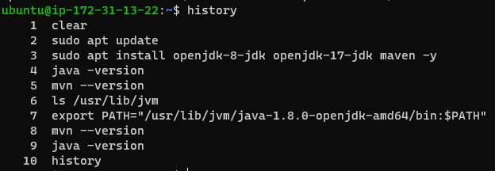

* Complete installing jenkins

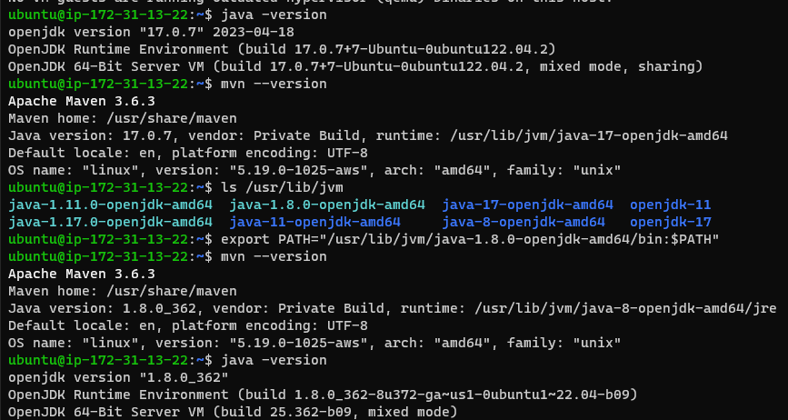

* Start working creating project and the Shell Scriptto be given is :

  *  export PATH="/usr/lib/jvm/java-1.8.0-openjdk-amd64/bin:$PATH"
  * java -version
  * mvn --version
  * git clone https://github.com/wakaleo/game-of-life
  * cd game-of-life
  * mvn package

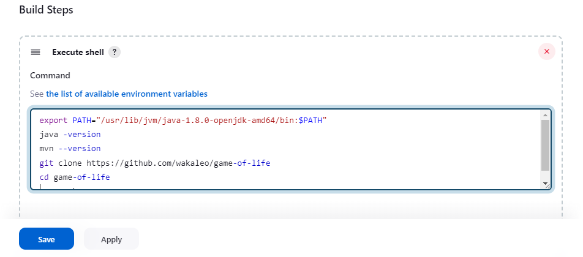

* Proceed and check  for the output :

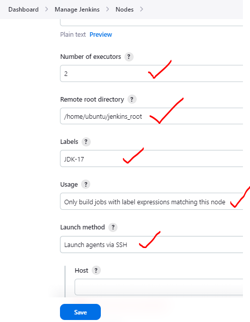
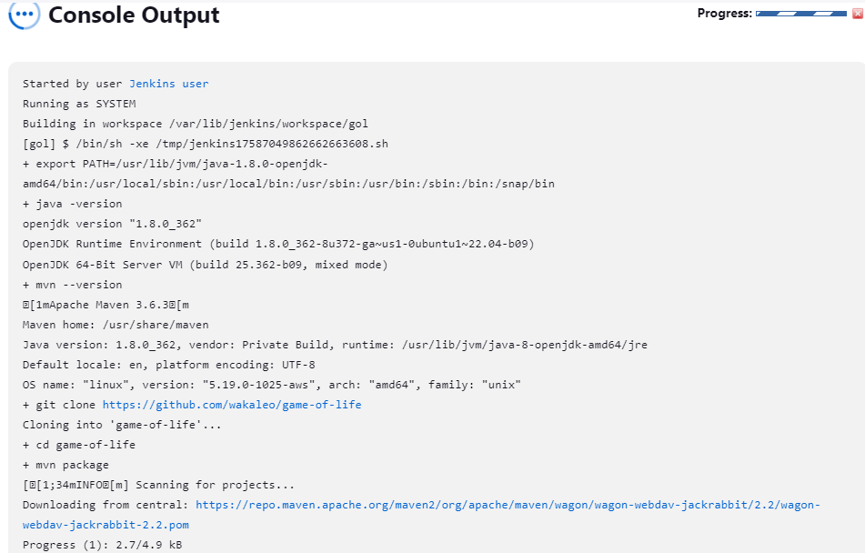
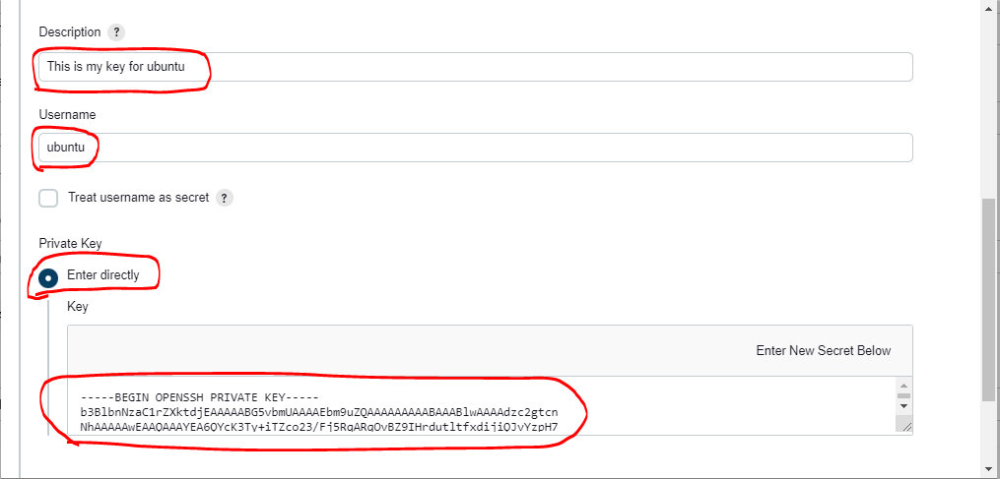

* Setting different java or other tools

Manage Jenkins => Global Tool Configuration => JDK => Add JDK

* add no.of versions that we need
, give the name and home directory for java-17 and java-8 and also maven

## Create a new project for Game-of-life (over the UI selection options instead of the manual steps)

* General : -> description-general information about build project
* Source code management : This section is about the version control information of the project
* Git : as the project is of opensource we provide the url,branch name

=> Save the project
=> Home directory of jenkins 'JENKINS_HOME'
=> Become a root user
=> Switch as a jenkins user
=> ls...ls jobs/.....ls -al jobs/.....ls -al jobs/< project-name >/

* To view the contents of config.xml file
=> 'cat jobs/< project-name >/config.xml'

=> Every detail we provide in the UI of jenkins is converted into the xml file in the home directory internally

=> After building the project go to the workspace directory in the folder with < project-name >

* Build Triggers : when to trigger the build
* Build Environment : what to be built in the project
* Build steps : what to be done before building the project (there are many options)
* Post Build Actions : what to be done after build in the project 
=> Sending email
=> Setting GitHub status

 * Save and build the job and run the project (GOL with t3.micro)

 * To preserve the work done (or) backup to the project
 => we take the backup of '/var/lib/jenkins' folder frequently

* After running the project we also get unit test results

=> In post build Actoins select 'Publish Junit test result report' option

=> For test report xml '**/surefire-reports/TEST-*.xml' 

=> To show the results and artifact made on the dashboard - Configure -> Post-build Actions -> Archive the artifacts -> Files to archive - '**/target/< project-name >.war'

[After every change you make inorder to get the results, we need ti build again and again]

[ If the working is delayed, we can resize the machine only after stopping the machine and restarting it again ]

 ## Plug-In in Jenkins

* It is an additional functionality provided , which will add functionality to Jenkins not to the machine(Virtual Machines) which we run 
( not an installation on the 'Jenkins master node' )

=> Dashboard
=> Manage Jenkins
=> Plugin Manager
=> Installed plugins
=> Available plugins => search for the required plugins

## Build Excecutors (Build Executor Status)

* on Jenkins node determines how many projects can be built parallely
* An individual project by default gets only one executor, if you want to change this, we can give the no.of builds we want into
'General -> Throttle builds' and also to limit the no.of builds

=> Every node in Jenkins can be configured with no.of executors
'Manage Jenkins -> Manage Nodes and Clouds -> Built-in Node -> Configure -> Put no.of executors you require

## Distributed Builds

* Jenkins has 2 types of nodes :
     1. Master node : On which we install jenkins
     2. Node : On which we run the job which matches the label definition

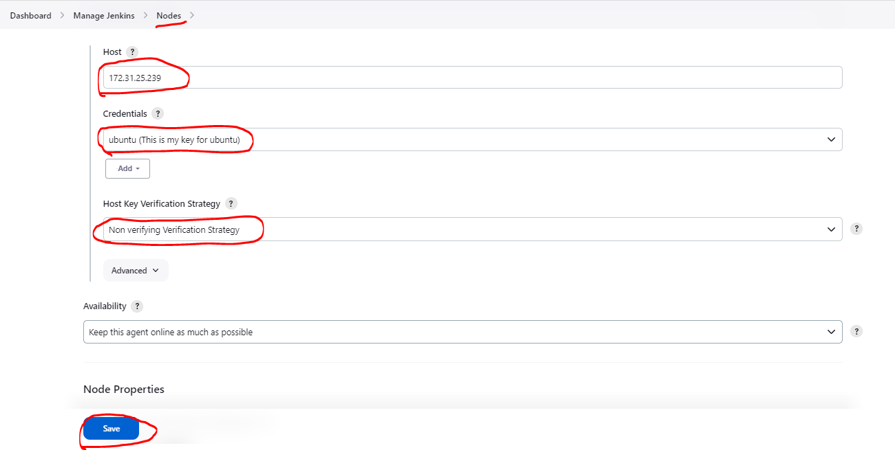

* Adding more nodes(of different servers) increases no.of executors which means we can build more projects
* And to make Jenkins highly vailable also we increase the no.of master nodes those share a same folder 'var/lib/jenkins' we store the behaviour of that node
* So if even one server goes down the other is stayed as backup with doing the same work 

## Let's add a node(linux-ubuntu) to the master node

* Create two vm's with same configurations
* Install Java and Jenkins on the master node

##  Multi node configuration

