### Install-JENKINS

* [Refer Here : https://www.jenkins.io/doc/book/installing/linux/] for installing jenkins on linux
* Installing on Ubuntu-steps: 
    [Refer Here : https://www.jenkins.io/doc/book/installing/linux/#debianubuntu]
```
sudo apt update 
sudo apt install openjdk-17-jdk -y
curl -fsSL https://pkg.jenkins.io/debian-stable/jenkins.io-2023.key | sudo tee /usr/share/keyrings/jenkins-keyring.asc > /dev/null
echo deb [signed-by=/usr/share/keyrings/jenkins-keyring.asc] https://pkg.jenkins.io/debian-stable binary/ | sudo tee /etc/apt/sources.list.d/jenkins.list > /dev/null
sudo apt-get update
sudo apt-get install jenkins -y
```
* Navigate to `http://<public-ip>:8080`


* Find the initial Admin password
```
sudo cat /var/lib/jenkins/secrets/initialAdminPassword
```


* Now install suggested plugins


* Create a new admin user


### CONTINUOUS INTEGRATION and CONTINUOUS DELIVERY/DEPLOYMENT

* To perform frequent integrations and deployments we need a tool which can help us doing the same stuff and integrate with multiple tools. These tools are generally called as `CI/CD Engines`
* Jenkins is popular Opensource CI/CD Engine
* Any CI/CD tool at it's core is a `CRON` on steroids

#### CRONJOB In Linux - CRONTAB (periodic tasks on steroids)
      [Refer Here : https://crontab.guru/]

* “cron” is a Linux-based utility used to schedule scripts or programs
* The `CRONTAB` is a list of commands that you want to run on a regular schedule, and also the name of the command used to manage that list. Crontab stands for “CRON TABLE”, because it uses the job scheduler cron to execute tasks
```
Syntax : <Minute> <Hour> <Day_of_the_Month> <Month_of_the_Year> <Day_of_the_Week> <command>
```


* Minute – value can be between 0-59
* Hour – value can be between 0-23
* Day_of_the_month – value can be between 1-31. For the months having fewer days will ignore remaining part
* Month_of_the_year – value can be between 1-12. You can also define this value with the first three alphabets of the month like jan, feb, mar, apr etc.
* Day_of_the_Week – value can be between 0-7. Where 0 and 7 for Sunday, 1 for Monday, 2 for Tuesday, and so on. You can also use the first three alphabets of days like sun, mon, tue, wed, etc.

#### CRONJOB In Windows - TASK SCHEDULER
       [Refer Here : https://linuxhint.com/set-up-cron-job-windows/]

* In Windows, it is mostly utilized to automate the update system and scheduled tasks that will run automatically without manual execution. 
* If you want to create a new task or cron job on Windows, perform the required operation with the help of the “TASK SCHEDULER”.

#### What happens when we install jenkins..?

* When we install jenkins we will have a default user created called as `JENKINS`
    * From jenkins we can perform anything which jenkins user performs


* How can we integrate jenkins with any other tools:
    * COMMAND LINE: call the command line
    * PLUGIN(Just gives an UI option to add in order to be converted to low level linux commands) + installation/configuration
      * UI or PIPELINE step

#### PATH variable 'echo $PATH'
      * To find path in linux 'whereis <needed-name>'
#### Environment Variable
      * Every process in the system have their own ID and CPU, here Environmental variable stays common for all the processes in a system
      * System environmental variable(available to all the users present in a system) 'sudo vi /etc/environment'
      * User environmental variable (available only to the specific user) 'home/bashrc'

#### NOTE:
      * Adding sudo permission to Linux user 
          [Refer Here: https://www.baeldung.com/linux/sudo-privileges-user]
```
sudo visudo

jenkins (ALL:ALL) NOPASSWD:ALL
```
#### COMPILER vs INTERPRITOR vs HYBRID based applications

* COMPILER-based application

  [Dubbing before running the application] 


* INTERPRETOR-based application

  [Translation during running of the application]


* HYBRID-based (both compiler and interpretor) application

  [Before running the application the compilation is done to Intermediate Language and then through the Interpretor coverts into server understandable]


### DEPENDENCIES

* Whenever a software project is developed, they have lot of dependencies
* Before building the code, dependencies have to be present locally
* To manage these dependencies, every programming language has some kind of package manager

[NOTE : Package Management is downloading the packages, building the packages and distributing the packages]

  * dotnet: `nuget` is the package manager
     * File to store the dependencies `packages.config/packages.json`
  * java: `maven` can handle package management
  * python: `pip` is the package manager
  * nodejs: `npm` can handle package management

### BUILD (every build) Workflow Structure

* Scope of Work :


## MAVEN

* Maven is a tool which can be used to build, package, distribute, test and generate documentation for java and java-based languages(groovy,scala)
* It follows convention(SNAPSHOT & RELEASE) over configuration
* It uses a file called as 'pom.xml' ( POM - Project Object Model )
* Apache Log4j Security Vulnerabilities

* ARTIFACTS (reasons) : 

=> To avoid the errors occuring freshly

=> To try to resolve the existing errors

### MAVEN Installation:

#### Install JAVA-17
```
sudo apt update
sudo apt install openjdk-17-jdk -y
java -version
```
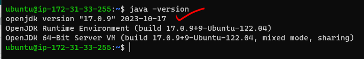

* Let's try installing MAVEN 3.9.3 

    [Refer Here: https://maven.apache.org/download.cgi]
```
cd /tmp/
wget https://dlcdn.apache.org/maven/maven-3/3.9.3/binaries/apache-maven-3.9.3-bin.tar.gz
sudo mkdir /usr/share/maven
sudo tar -xvzf apache-maven-3.9.3-bin.tar.gz -C /usr/share/maven
# add `/usr/share/maven/apache-maven-3.9.3/bin` to the PATH variable
# add to `~/.bashrc` or `/etc/environment`
cd ~
sudo vi /etc/environment
# exit and relogin
mvn --version
```


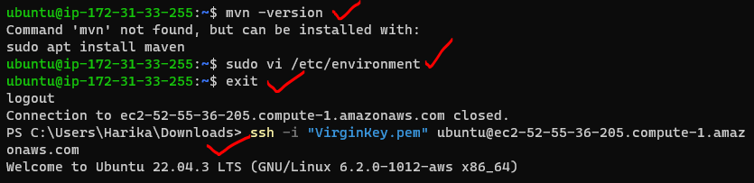


#### MAVEN GOALS and LIFECYCLE :
    [Refer Here : https://www.baeldung.com/maven-goals-phases]

* VALIDATE: validates the pom and it's project
* COMPILE: converts the java code into byte code (.java to .class). It stores the class files in `target/classes`
* TEST: will run the unit tests written and generates test results in xml format of text format. Folder will be `/target/surefire-reports/TEST-*.xml`


* PACKAGE: creates the packaging format (jar/war/ear) and will be `<artifact-id>-<version>.<packaging-format>`
* INSTALL: copies the package and it's definition into `M2_HOME` or `~/.m2/repository`
* DEPLOY: copying package and it's definition to remote repository for other users in other systems to use what you have built (This command is equivalent to git push command)
* CLEAN: removes target folder

=> Here, when we execute a goal, all the pevious goals also get's executed

##### LIFECYCLE 
 
       [Refer Here : https://maven.apache.org/guides/introduction/introduction-to-the-lifecycle.html#Lifecycle_Reference]
* To execute any lifecycle goal `mvn <goal>`
* Simple POM file
```xml
<project>
  <modelVersion>4.0.0</modelVersion>
  <groupId>io.learningthoughts.samples</groupId>
  <artifactId>hello-maven</artifactId>
  <version>1.0.0-SNAPSHOT</version>
  <properties>
     <maven.compiler.source>11</maven.compiler.source>
     <maven.compiler.target>11</maven.compiler.target>
  </properties>
  <dependencies>
    <dependency>
    <groupId>junit</groupId>
    <artifactId>junit</artifactId>
    <version>4.13.2</version>
    <scope>test</scope>
   </dependency>
  </dependencies>
</project>
```
* Maven PACKAGING formats: 
    [Refer Here : https://www.baeldung.com maven-packaging-types#:~:text=Maven%20offers%20many%20default%20packaging%20types%20that%20include%20a%20jar,and%20performs%20a%20specific%20task.]
* Maven goals downloads dependencies and stores in
  * `M2_HOME` where ever this environment variable points to and if not found does in `<home-dir>/.m2`

  ### Exercise

* Try installing maven and create a simple jenkins project with following build steps:
```
git clone https://github.com/spring-projects/spring-petclinic.git
cd spring-petclinic 
mvn package
```
#### MANUAL STEPS :

##### Installing JAVA-17
```
sudo apt update
sudo apt install openjdk-17-jdk -y
java -version
```
##### Installing MAVEN
```
cd /tmp/
wget https://dlcdn.apache.org/maven/maven-3/3.9.3/binaries/apache-maven-3.9.3-bin.tar.gz
sudo mkdir /usr/share/maven
sudo tar -xvzf apache-maven-3.9.3-bin.tar.gz -C /usr/share/maven
cd ~
sudo vi /etc/environment
# add '/usr/share/maven/apache-maven-3.9.3/bin'
exit
# relogin into the machine
mvn --version
```
##### Building SPRING-PETCLINIC
```
git clone https://github.com/spring-projects/spring-petclinic.git
cd spring-petclinic/
mvn package 
```
### TERMS

* ARTIFACT 

=> For generating artifacts we use build tools like msbuild, maven/gradle

=> These are referenced in a pipeline stage for automated deployment to the target environment

* UNIT TEST 

=> java-junit, microsoft-mstest/nunit, python-pytest, nodejs-jasmine, nodejs-mocha, most CI/CD systems understand junit xml reports to generate test results
            
=> incorporating unit testing into the DevOps process, which involves automating the entire software development life cycle to enable faster delivery of software while maintaining its quality

* CODE COVERAGE 

=> we do this from Sonar Qube

=> helps you determine the proportion of your project's code that is actually being tested by tests such as unit tests. To increase your confidence of the code changes, and guard effectively against bugs, your tests should exercise - or cover - a large proportion of your code

[ Code Coverage = Branch Coverage (testing method, which aims to ensure that each one of the possible branch from each decision point is executed at least once and thereby ensuring that all reachable code is executed) + Line Coverage (how many of lines of source code have been tested) ]

* STATIC CODE ANALYSIS 

=> we do this from Sonar Qube, figuring best code analysis

=> method of computer program debugging that is done by examining the code without executing the program. The process provides an understanding of the code structure and can help ensure that the code adheres to industry standards

* ARTIFACT REPOSITORY 

=> we would use jfrog (azure artifacts)

=> Artifacts are large binary packages that are created throughout the development and release process. An artifact repository is a software application designed to manage these artifacts

### Building Maven projects using Jenkins  

#### JENKINS CONFIGURATION

* Install jenkins (jdk-17)
* Install and configure maven in Jenkins (Master Node)

    * Start a vm

      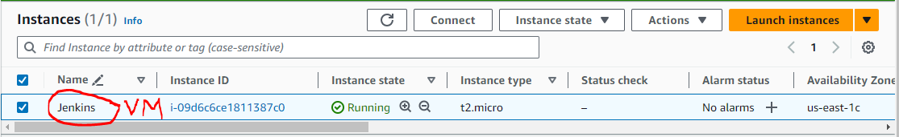

    * Install java-17

      

    * Install jenkins and configure as jenkins user

      

    * Add jenkins to sudoers   WORKSPACE: `/var/lib/jenkins`

      

    * Install maven as a root-jenkins user

      
    
* Let's build spring-petclinic 
    [Refer Here : https://github.com/spring-projects/spring-petclinic]

    * software requirements
      * jdk-17
      * maven

* Create a free style project to build spring-petclinic

=> New item => Freestyle project (name= spc-daybuild) => ok


* Free-style project sections

=> Description : This is to build spring-petclinic project 

1. GENERAL: This represents the project information
      
    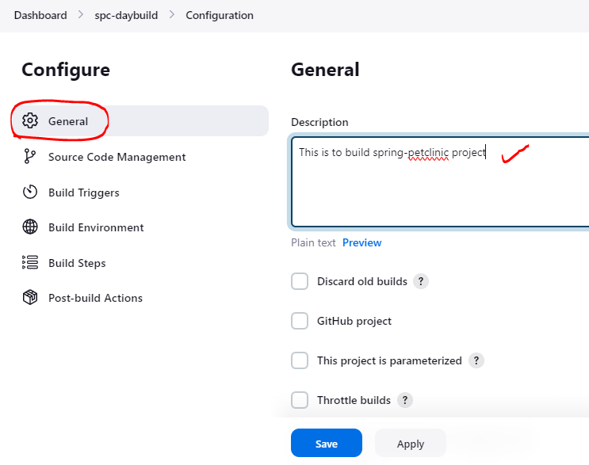

2. SOURCE CODE MANAGEMENT: This represent the code to be used for CI/CD pipelines

    

3. BUILD TRIGGERS: represents when to build

  * BUILD PERIODICALLY(CRON): If the project has to be built based on schedule, write cron expression into this 
                                [Refer Here : https://crontab.guru/]

  * POLL SCM: represents jenkins polling scm (asking git) and the cron expression represents how frequently it should ask. It is triggered only when there are changes in the code.

    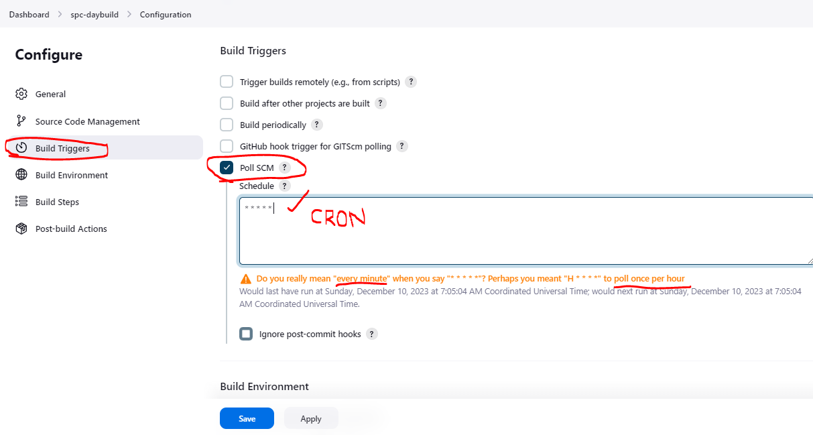

4. BUILD ENVIRONMENT: represents the environmental configuration

   

5. BUILD STEPS: actual activities that are performed during execution

   
   

6. POST BUILD ACTIONS: actions to be performed after completion of build

   
   

* Now we can wait for the trigger to call the job or trigger build manually

 
 

* In Jenkins we can have multiple versions of java, maven, etc and we can handle these by configuring jenkins
* To fix the maven 3.6.3, issue we have to install 3.9.4 and use full path for package
```
cd /tmp
wget https://dlcdn.apache.org/maven/maven-3/3.9.4/binaries/apache-maven-3.9.4-bin.tar.gz
sudo mkdir /usr/share/maven3.9
sudo tar -xvzf apache-maven-3.9.4-bin.tar.gz -C /usr/share/maven3.9
cd spring-petclinic/
/usr/share/maven3.9/apache-maven-3.9.4/bin/mvn package
```
* Go back and re-configure the maven version

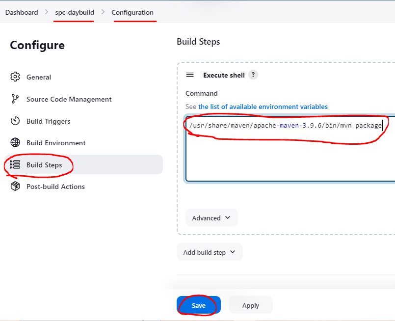
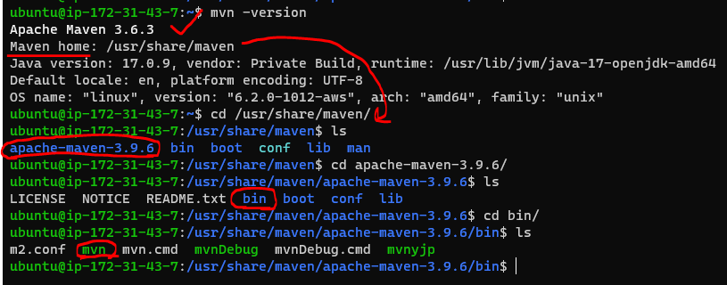


* Test results

  
  
  

  ### Jenkins TERMS :

* JENKINS_HOME: Jenkins home is a folder where jenkins stores all of it's configuration. In the above case the workspace is `/var/lib/jenkins`. If you want to change the workspace deal with `JENKINS_HOME`


* Backup for Jenkins is backup of Workspace (/var/lib/jenkins)

* PROJECT: This contains the activity that needs to be performed on triggers
    * This project is stored as xml file in workspace
    * Types of projects :
      * Freestyle project: This is UI based configuration
      * Pipeline: This is instructions expressed in some code format (pipeline as a code)

* BUILD: This represents the execution of project. Every build for a project has a running number called as Build_id

* NODE: This represents the machine on which build can be executed. Each Node can be configured to handle multiple builds by executors(no.of parallel working projects)

### Managing DIFFERENT VERSIONS of the tools using jenkins

* Connect to the jenkins installed vm 

=> Manage jenkins => Tools => Maven installations

  
  

* Connect to the machine through command line
```
sudo -i
su jenkins
cd /usr/share/maven (maven 3.6.3)
ls
cd /usr/share/maven/apache-maven-3.9.4   (maven 3.9.4)
```
  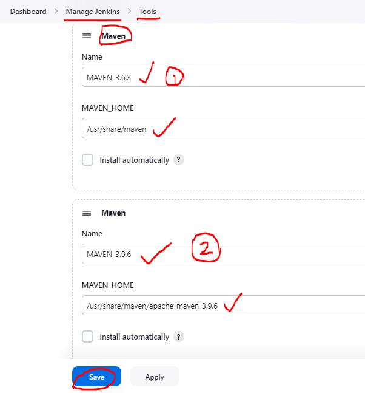

* Now lets configure the spring-petclinic to use top level maven targets

  

* Now build the project manually (Build Now)

  

### DISTRIBUTED BUILDS

* Setup:
  1. Fork Spring-petclinic   
      => spring-petclinic github => fork => owner,repo name => copy main branch only => create fork
      
      [Refer Here : https://github.com/Harika-SVL/spring-petclinic]

    * requirements to build
        * java jdk 17
        * maven 3.9

  2. Fork game of life 
      => game of life github => fork => owner,repo name => copy main branch only => create fork

      [Refer Here : https://github.com/Harika-SVL/game-of-life]
    
    * requirements to build
        * java 8
        * maven

  3. Fork nopcommerce
      => nopcommerce github => fork => owner,repo name => copy main branch only => create fork

      [Refer Here : https://github.com/Harika-SVL/nopCommerce]
     
    * requirements to build
        * dotnet 7

* To handle different builds with different software needs, we tend to use different servers.
* Jenkins has distributed builds where we can distribute the builds on differnt nodes by matching labels

* While creating a project we can set labels and expect them to be executed on the node matching labels

  

#### How to add MULTIPLE NODES to jenkins

* Let's create 2 ubuntu VM's and let's make one vm the jenkins-master
* On it install java-17,jenkins and configure jenkins and add the user to sudoers
```
sudo apt update
sudo apt install openjdk-17-jdk -y
```
##### NOTE
=> To install jenkins we can use the following script
```bash
#!/bin/bash
curl -fsSL https://pkg.jenkins.io/debian-stable/jenkins.io-2023.key | sudo tee /usr/share/keyrings/jenkins-keyring.asc > /dev/null
echo deb [signed-by=/usr/share/keyrings/jenkins-keyring.asc] https://pkg.jenkins.io/debian-stable binary/ | sudo tee /etc/apt/sources.list.d/jenkins.list > /dev/null
sudo apt-get update
sudo apt-get install openjdk-17-jdk jenkins -y
```
  

* To check the sudoers
```
sudo -i
su jenkins
cd ~
sudo apt update
```
### Node 1 => JDK-17 and maven 3.9.4

* let's make other vm the node-1
* On this node (we will be using existing credentials) we will install java-17 and install maven 3.9.4
```
sudo apt update
sudo apt install openjdk-17-jdk -y
```
```
cd /tmp
wget https://dlcdn.apache.org/maven/maven-3/3.9.4/binaries/apache-maven-3.9.4-bin.tar.gz
sudo mkdir /usr/share/maven
sudo tar -xvzf apache-maven-3.9.4-bin.tar.gz -C /usr/share/maven
sudo vi /etc/environment
# add ':/usr/share/maven/apache-maven-3.9.4/bin'
exit
# relogin
mvn --version
```

  

* Now let's configure the jenkins-master node with label `JDK-17`
* On Jenkins UI Navigate to 

=> Manage Jenkins => Nodes and Clouds

  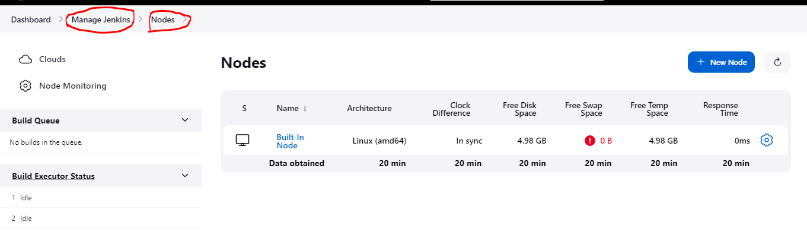

=> New node => name: node-1 , select permanent agent => create

  

* Configuring the node-1 information

  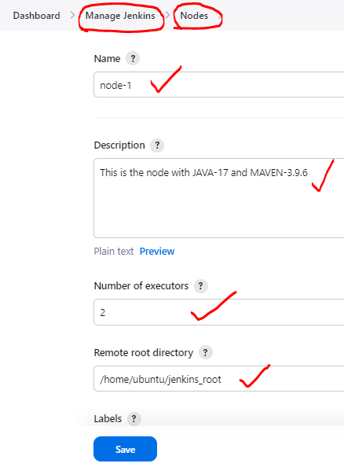
  

=> host : node private_ip (both in same network) => credentials : select jenkins => select kind and id

  

=> Add description, Username => select Enetr directly => add ssh-private key (cat id_rsa) => Add

  

=> Add Host, credentials, Host key => Save

  

* node-1 gets connected

  


#### Let's setup spring-petclinic to execute on node-1

* Configure spc-day build same as last session with one restriction in General section

* Start a new project

  

=> Select source code management => git : select new forked url, branch: main

  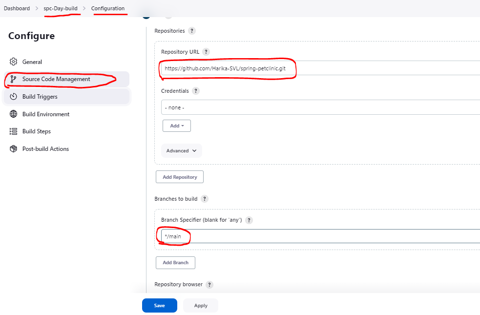

=> Select Build Triggers => Poll SCM : * * * * *

  

=> selecct Build Steps => Invoke top-level maven targets => Goals : package => Save

  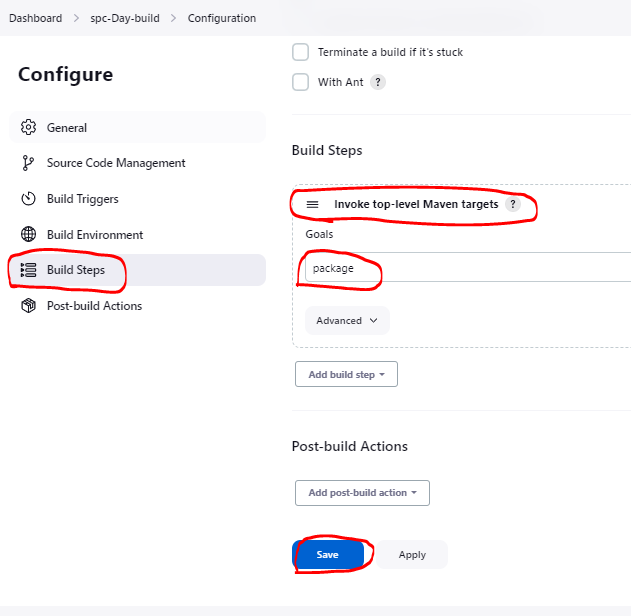

=> go to configure again => select when to run => Add label => Save

  

* Now build and verify the console output

  
  
  

* Now let's add processing the test results `**/surefire-reports/TEST-*.xml`
* As a result of this project's build, I get `gameoflife.war` which is called as `ARTIFACT`. Let's configure jenkins to archive the artifacts

  
  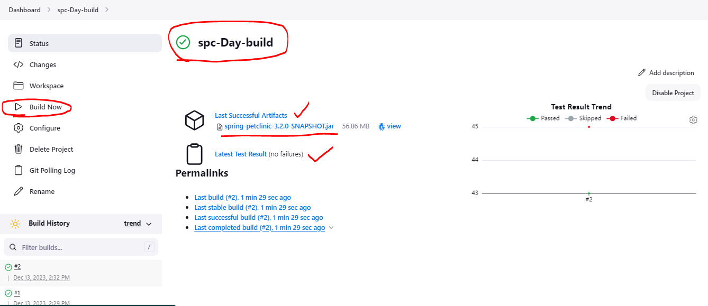

#### Exercises

* Create a jenkins master with t2.micro (ubuntu)
* Create a node with any other os redhat/centos/amazon linux
    * install jdk 17
* Create a job which should run on the other node configure and display its ip address and environmental variables printenv

### Node 2 => JDK-8 and maven

* On the jenkins-master we would require jdk-17 and for the project game-of-life we would require jdk-8
* On the node-2, let's create a new user called as devops and add to sudoers with `NOPASSWD`
```
sudo adduser devops
# password : devops
sudo visudo
# devops  ALL=(ALL:ALL) NOPASSWD:ALL
```
* Now enable password based authentication
```
sudo vi /etc/ssh/sshd_config
# Change password Authentication to yes
sudo systemctl restart sshd
```
* Restart as devops user
```
exit
ssh devops@<public_ip>
password : devops
```
* Install jdk-8, jdk-17 and maven
```
sudo apt update
sudo apt install openjdk-8-jdk openjdk-17-jdk -y
sudo apt install maven -y
```
* Now execute java -version

  

* Lets configure JDK-17 and JDK-8 paths in tools section of jenkins (jenkins-master)

  

* Now add node-2 to jenkins

  

=> Configuring credentials

  
  
  

* Now let's try building game of life

  
  
  

=> Build Now 

  

* Now let's add processing the test results `**/surefire-reports/TEST-*.xml`

  
  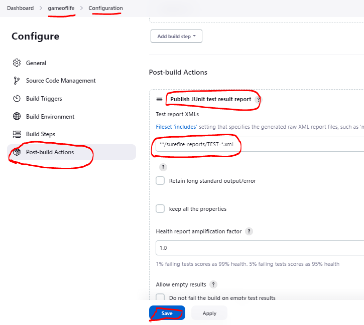

=> Build Now

  

* As a result of this project's build, I get `gameoflife.war` which is called as `ARTIFACT`. Let's configure jenkins to archive the artifacts

  

=> Build Now

  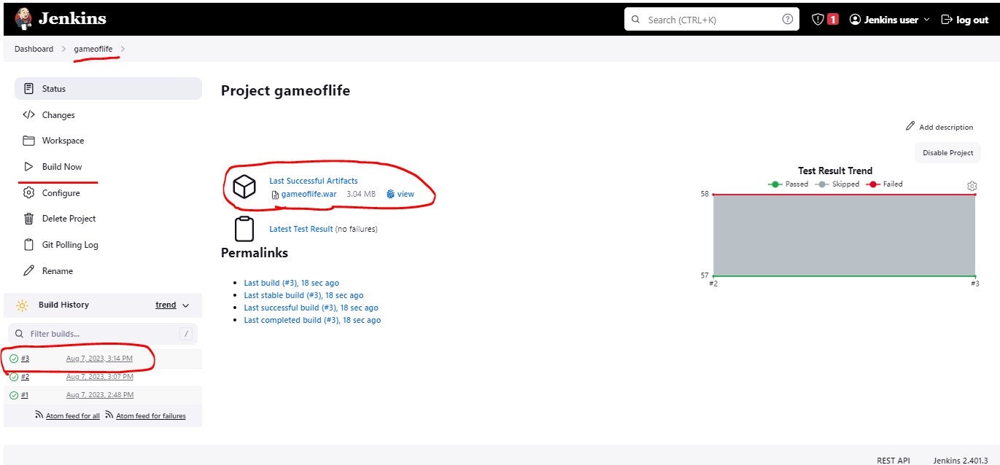

* Note: We have implemented the same for spring petclinic

  
  

* Note: The health of the builds is represented as weather in jenkins
    * cloudy means builds are failing
    * sunny means the builds are successful

  

### Node 3: Executing dotnet project on jenkins

* For agent we required jdk-17
* Create an ec2 instance (node-3)  with size 20 GB
* install dotnet-7 sdk for running nop comerce
* Installation instructions 
  [Refer Here : https://learn.microsoft.com/en-us/dotnet/core/install/linux-ubuntu-2204]
```
sudo apt-get update && \
  sudo apt-get install -y dotnet-sdk-7.0
dotnet --help
```
  

* Configuring node-3 on dashboard

  
  

=> Install jdk-17 on the node

  
  

* to build the dotnet project we need to restore nuget packages
```
cd /tmp/
git clone https://github.com/Harika-SVL/nopCommerce.git
cd nopCommerce
git branch
# dotnet restore <path of project or sln>
dotnet restore src/NopCommerce.sln
# For night builds
# dotnet build  -c "Release" <path of project or sln> 
dotnet build -c Release src/NopCommerce.sln
# For day builds
# dotnet build  -c "Debug" <path of project or sln> 
```
### Upstream and Downstream projects

* If the project A triggers the Project B then
    * Project B is downstream of Project A
    * Project A is upstream of Project B

  

### Parametrized Builds

* While building the jobs, sometimes we would like users to pass some information.
* This is called as parameters
* Let's enable parameters for some jenkins project/job

### Jenkins Environmental variables

* Jenkins injects environmental variables into every job in addition to environmental variables present on node
* To view environmental variables Naviage to build steps => execute shell
* Refer Here for docs on environmental variables
* Sample using environmetal variables
* Result

#### How to take backup of jenkins

* One option for backup of configuration files

#### Which plugin should be installed to monitor jenkins

* Refer Here

* Jenkins Plugins can be installed from
    * Market place
    * Uploading the plugin
* Jenkins plugin has two extensions
    * jpi (Jenkins plugin interface)
    * hpi (hudson plugin interface)

#### Exercise

* Figure out a plugin to chnage Build id
* Create a folder in /tmp of your node with project name
```
/tmp/gameoflife
```
* In this folder try to create one more folder with build id
```
/tmp/gameoflife/5
```
* to this folder copy the war/jar file