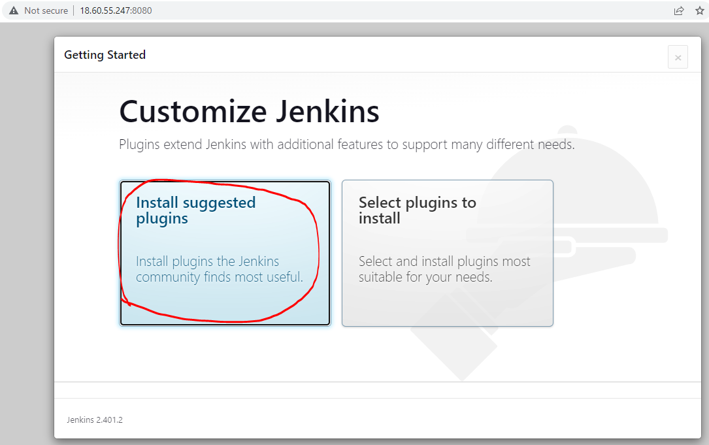
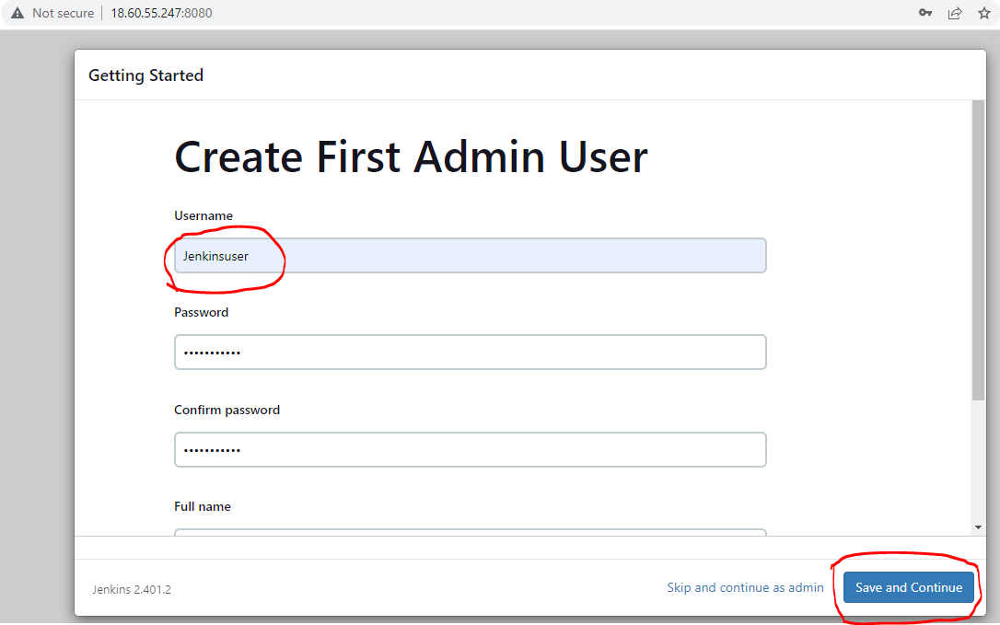

### Install – Jenkins

* [Refer Here : https://www.jenkins.io/doc/book/installing/linux/] for installing jenkins on linux
* Ubuntu steps: [Refer Here : https://www.jenkins.io/doc/book/installing/linux/#debianubuntu]
```
sudo apt update 
sudo apt install openjdk-17-jdk -y
curl -fsSL https://pkg.jenkins.io/debian-stable/jenkins.io-2023.key | sudo tee \
  /usr/share/keyrings/jenkins-keyring.asc > /dev/null
echo deb [signed-by=/usr/share/keyrings/jenkins-keyring.asc] \
  https://pkg.jenkins.io/debian-stable binary/ | sudo tee \
  /etc/apt/sources.list.d/jenkins.list > /dev/null
sudo apt-get update
sudo apt-get install jenkins -y
```
* Navigate to `http://<public-ip>:8080`


* Find the initial Admin password
```
sudo cat /var/lib/jenkins/secrets/initialAdminPassword
```


* Now install suggested plugins




* Create a new admin user




