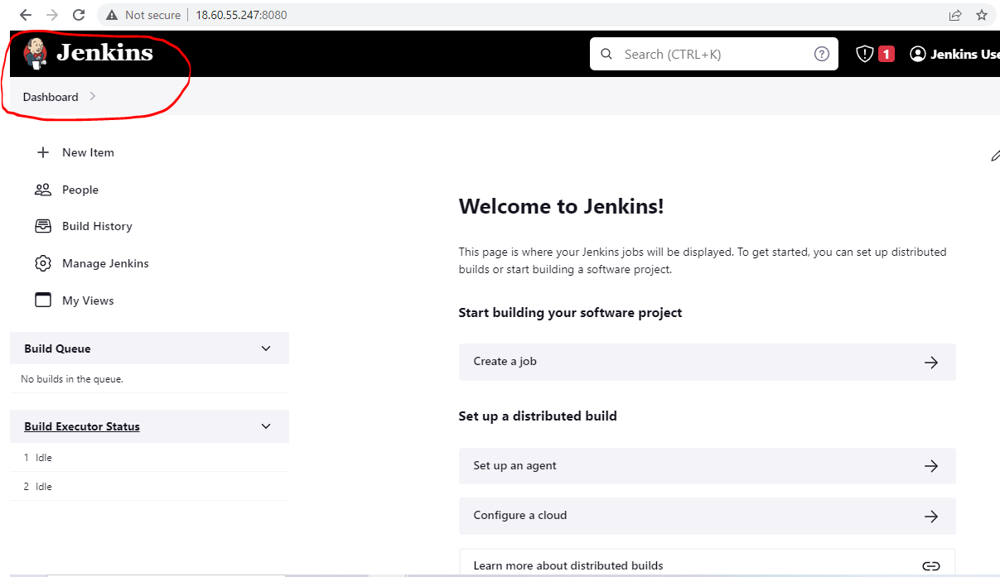
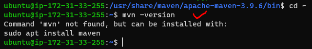
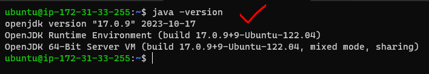
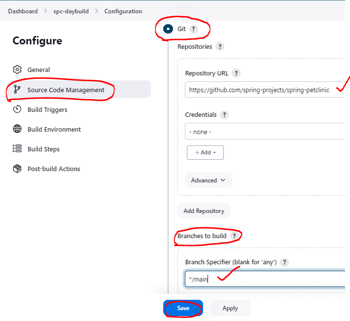
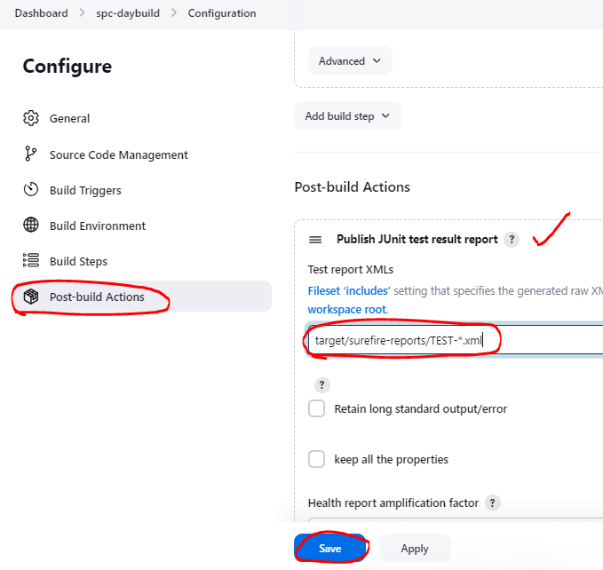
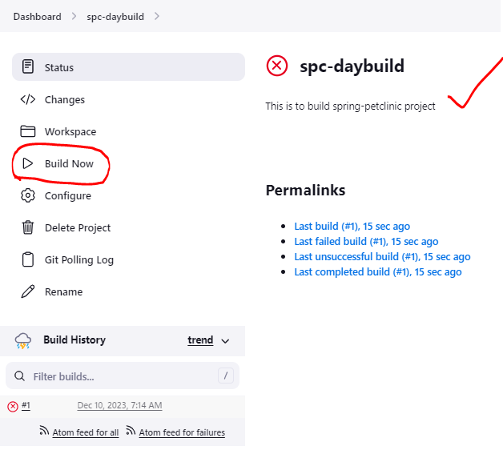

### Install – Jenkins

* [Refer Here : https://www.jenkins.io/doc/book/installing/linux/] for installing jenkins on linux
* Installing on Ubuntu-steps: 
    [Refer Here : https://www.jenkins.io/doc/book/installing/linux/#debianubuntu]
```
sudo apt update 
sudo apt install openjdk-17-jdk -y
curl -fsSL https://pkg.jenkins.io/debian-stable/jenkins.io-2023.key | sudo tee /usr/share/keyrings/jenkins-keyring.asc > /dev/null
echo deb [signed-by=/usr/share/keyrings/jenkins-keyring.asc] https://pkg.jenkins.io/debian-stable binary/ | sudo tee /etc/apt/sources.list.d/jenkins.list > /dev/null
sudo apt-get update
sudo apt-get install jenkins -y
```
* Navigate to `http://<public-ip>:8080`


* Find the initial Admin password
```
sudo cat /var/lib/jenkins/secrets/initialAdminPassword
```


* Now install suggested plugins


* Create a new admin user




### Continuous Integration and Continuous Delivery/Deployment

* To perform frequent integrations and deployments we need a tool which can help us doing the same stuff and integrate with multiple tools. These tools are generally called as `CI/CD Engines`
* Jenkins is popular Opensource CI/CD Engine
* Any CI/CD tool at it's core is a `Cron` on steroids

#### Cronjob in Linux - Crontab (periodic tasks on steroids)
      [Refer Here : https://crontab.guru/]

* “cron” is a Linux-based utility used to schedule scripts or programs
* The `Crontab` is a list of commands that you want to run on a regular schedule, and also the name of the command used to manage that list. Crontab stands for “cron table, ” because it uses the job scheduler cron to execute tasks
```
Syntax : <Minute> <Hour> <Day_of_the_Month> <Month_of_the_Year> <Day_of_the_Week> <command>
```


* Minute – value can be between 0-59
* Hour – value can be between 0-23
* Day_of_the_month – value can be between 1-31. For the months having fewer days will ignore remaining part
* Month_of_the_year – value can be between 1-12. You can also define this value with the first three alphabets of the month like jan, feb, mar, apr etc.
* Day_of_the_Week – value can be between 0-7. Where 0 and 7 for Sunday, 1 for Monday, 2 for Tuesday, and so on. You can also use the first three alphabets of days like sun, mon, tue, wed, etc.

#### Cronjob in Windows - Task Scheduler
       [Refer Here : https://linuxhint.com/set-up-cron-job-windows/]

* In Windows, it is mostly utilized to automate the update system and scheduled tasks that will run automatically without manual execution. 
* If you want to create a new task or cron job on Windows, perform the required operation with the help of the “Task Scheduler”.

#### What happens when we install jenkins..?

* When we install jenkins we will have a default user created called as `jenkins`
    * From jenkins we can perform anything which jenkins user performs


* How can we integrate jenkins with any other tools:
    * Command line: call the command line
    * Plugin(Just gives an UI option to add in order to be converted to low level linux commands) + installation/configuration
      * UI or Pipeline step

#### PATH variable 'echo $PATH'
        * To find path in linux 'whereis <needed-name>'
#### Environment variable
        * Every process in the system have their own ID and CPU, here Environmental variable stays common for all the processes in a system
        * System environmental variable(available to all the users present in a system) 'sudo vi /etc/environment'
        * User environmental variable (available only to the specific user) 'home/bashrc'

#### Note:
  * Adding sudo permission to Linux user 
      [Refer Here: https://www.baeldung.com/linux/sudo-privileges-user]
```
sudo visudo

jenkins (ALL:ALL) NOPASSWD:ALL
```
#### Compiler vs interpretor vs hybrid based applications

* Compiler-based application

  [Dubbing before running the application] 


* Interpretor-based application

  [Translation during running of the application]


* Hybrid based (both compiler and interpretor) application

  [Before running the application the compilation is done to Intermediate Language  and then through the Interpretor coverts into server understandable]


### Dependencies

* Whenever a software project is developed, they have lot of dependencies
* Before building the code, dependencies have to be present locally
* To manage these dependencies, every programming language has some kind of package manager

[NOTE : Package Management is downloading the packages, building the packages and distributing the packages]

  * dotnet: `nuget` is the package manager
     * File to store the dependencies `packages.config/packages.json`
  * java: `maven` can handle package management
  * python: `pip` is the package manager
  * nodejs: `npm` can handle package management

### Build (every build) Workflow Structure

* Scope of Work :


## Maven

* Maven is a tool which can be used to build, package, distribute, test and generate documentation for java and java-based languages(groovy,scala)
* It follows convention(SNAPSHOT & RELEASE) over configuration
* It uses a file called as 'pom.xml'
* POM - Project Object Model
* Apache Log4j Security Vulnerabilities

* Artifacts(reasons) : 

=> To avoid the errors occuring freshly

=> To try to resolve the existing errors

### Maven Installation:

#### Install java-17
```
sudo apt update
sudo apt install openjdk-17-jdk -y
java -version
```


* Let's try installing maven 3.9.3 

    [Refer Here: https://maven.apache.org/download.cgi]
```
cd /tmp/
wget https://dlcdn.apache.org/maven/maven-3/3.9.3/binaries/apache-maven-3.9.3-bin.tar.gz
sudo mkdir /usr/share/maven
sudo tar -xvzf apache-maven-3.9.3-bin.tar.gz -C /usr/share/maven
# add `/usr/share/maven/apache-maven-3.9.3/bin` to the PATH variable
# add to `~/.bashrc` or `/etc/environment`
cd ~
sudo vi /etc/environment
# exit and relogin
mvn --version
```




#### Maven goals and Lifecycle :
    [Refer Here : https://www.baeldung.com/maven-goals-phases]

* Validate: validates the pom and it's project
* Compile: converts the java code into byte code (.java to .class). It stores the class files in `target/classes`
* Test: will run the unit tests written and generates test results in xml format in text format. folder will be `/target/surefire-reports/TEST-*.xml`
* Package: creates the packaging format (jar/war/ear)and will be `<artifact-id>-<version>.<packaging-format>`
* Install: copies the package and it's definition into `M2_HOME` or `~/.m2/repository`
* Deploy: copying package and it's definition to remote repository for other users in other systems to use what you have built (This command is equivalent to git push)
* Clean: removes target folder

=> Here, when we execute a goal, all the pevious goals also get's executed

* Lifecycle 
    [Refer Here : https://maven.apache.org/guides/introduction/introduction-to-the-lifecycle.html#Lifecycle_Reference]
* To execute any lifecycle goal `mvn <goal>`
* Simple pom file
```
<project>
  <modelVersion>4.0.0</modelVersion>
  <groupId>io.learningthoughts.samples</groupId>
  <artifactId>hello-maven</artifactId>
  <version>1.0.0-SNAPSHOT</version>
  <properties>
     <maven.compiler.source>11</maven.compiler.source>
     <maven.compiler.target>11</maven.compiler.target>
  </properties>
  <dependencies>
    <dependency>
    <groupId>junit</groupId>
    <artifactId>junit</artifactId>
    <version>4.13.2</version>
    <scope>test</scope>
   </dependency>
  </dependencies>
</project>
```
* Maven packaging formats: 
    [Refer Here : https://www.baeldung.com maven-packaging-types#:~:text=Maven%20offers%20many%20default%20packaging%20types%20that%20include%20a%20jar,and%20performs%20a%20specific%20task.]
* Maven goals downloads dependencies and stores in
  * `M2_HOME` where ever this environment variable points to and if not found does in `<home-dir>/.m2`

  ### Exercise

* Try installing maven and create a simple jenkins project with following build steps:
```
git clone https://github.com/spring-projects/spring-petclinic.git
cd spring-petclinic && mvn package
```
#### Manual steps :
```
## Installing java-17

sudo apt update
sudo apt install openjdk-17-jdk -y
java -version

## Installing maven

cd /tmp/
wget https://dlcdn.apache.org/maven/maven-3/3.9.3/binaries/apache-maven-3.9.3-bin.tar.gz
sudo mkdir /usr/share/maven
sudo tar -xvzf apache-maven-3.9.3-bin.tar.gz -C /usr/share/maven
cd ~
sudo vi /etc/environment
# add '/usr/share/maven/apache-maven-3.9.3/bin'
exit
# relogin into the machine
mvn --version

## Building spring-petclinic

git clone https://github.com/spring-projects/spring-petclinic.git
cd spring-petclinic/
mvn package 
```
### Terms

* ARTIFACT 

=> For generating artifacts we use build tools like msbuild, maven/gradle

=> These are referenced in a pipeline stage for automated deployment to the target environment

* UNIT TEST 

=> java-junit, microsoft-mstest/nunit, python-pytest, nodejs-jasmine, nodejs-mocha, most CI/CD systems understand junit xml reports to generate test results
            
=> incorporating unit testing into the DevOps process, which involves automating the entire software development life cycle to enable faster delivery of software while maintaining its quality

* CODE COVERAGE 

=> we do this from sonar qube

=> helps you determine the proportion of your project's code that is actually being tested by tests such as unit tests. To increase your confidence of the code changes, and guard effectively against bugs, your tests should exercise - or cover - a large proportion of your code

[ Code Coverage = Branch Coverage (testing method, which aims to ensure that each one of the possible branch from each decision point is executed at least once and thereby ensuring that all reachable code is executed) + Line Coverage (how many of lines of source code have been tested) ]

* STATIC CODE ANALYSIS 

=> we do this from sonar qube, figuring best code analysis

=> method of computer program debugging that is done by examining the code without executing the program. The process provides an understanding of the code structure and can help ensure that the code adheres to industry standards

* ARTIFACT REPOSITORY 

=> we would use jfrog (azure artifacts)

=> Artifacts are large binary packages that are created throughout the development and release process. An artifact repository is a software application designed to manage these artifacts

### Building Maven projects using Jenkins  

#### Jenkins configuration

* Install jenkins (jdk-17)
* Install and configure maven in Jenkins (Master Node)
    * Start a vm

      

    * Install java-17

      

    * Install jenkins and configure as jenkins user

      

    * Add jenkins to sudoers

      

    * Install maven as a root-jenkins user

      
    
* Let's build spring petclinic 
    [Refer Here : https://github.com/spring-projects/spring-petclinic]

    * software requirements
      * jdk-17
      * maven

* Create a free style project to build spring petclinic

=> New item => Freestyle project (name= spc-daybuild) => ok


* Free style project sections

=> Description : This is to build spring-petclinic project 

1. General: This represents the project information
      
    

2. Source Code Management: This represent the code to be used for CI/CD pipelines

    

3. Build Triggers: This represent when to build

  * Build Periodically(cron): If the project has to be build based on schedule, write cron expression into this 
                                [Refer Here : https://crontab.guru/]

  * Poll SCM: This represents jenkins polling scm (asking git) and the cron expression represents how frequently should it ask. It is triggered only when there are changes in the code.

    

4. Build Environment: This represents the environmental configuration

   

5. Build Steps: These are actual activities that are performed during execution

   
   

6. Post Build actions: Actions to be performed after completion of build

   
   

* Now we can wait for the trigger to call the job or trigger build manually

  
  

* In Jenkins we can have multiple versions of java, maven etc and we can handle these by configuring jenkins
* To fix the maven 3.6.3 issue we had install 3.9 and used full path for package
* Test results

  ### Jenkins Terms

* Jenkins Home: Jenkins home is a folder where jenkins stores all of it's configuration. In the above case the workspace is /var/lib/jenkins. If you want to change the workspace deal with JENKINS_HOME


* Backup of Jenkins is backup of Workspace

* Project: This contains the activity that needs to be performed on triggers
    * This project is stored as xml file in workspace
    * Types of projects :
      * Freestyle project: This is UI based configuration
      * Pipeline: This is instructions expressed in some code format (pipeline as a code)

* Build: This represents the execution of project. Every build for a project has a running number called as Build_id
* Node: This represents the machine on which build can be executed. Each Node can be configured to handle multiple builds by executors(no.of parallel working projects)

### Managing different versions of the tools using jenkins

* Connect to the jenkins installed vm 

=> Manage jenkins => Tools => Maven installations


* Connect to the machine through command line
```
sudo -i
su jenkins
cd /usr/share/maven (maven 3.6.3)
ls
cd /usr/share/maven/apache
```

* Now lets configure the spring petclinic to use top level maven targets

* Now build the project manually

### Distributed Builds

* Setup:
    * Fork Spring-petclinic   
        [Refer Here : ]
      * requirements to build
        * java jdk 17
        * maven 3.9
    * Fork game of life Refer Here
      * requirements to build
        * java 8
        * maven
    * Fork nopcommerce Refer Here
      * requirements to build
        * dotnet 7
* To handle different builds with different software needs, we tend to use different servers.
* Jenkins has distributed builds where we can distribute the builds on differnt nodes by matching labels

* While creating a project we can set labels and expect them to be executed on the node matching labels

#### How to add multiple nodes to jenkins

* Let's create 2 ubuntu vms and lets make one vm the jenkins master
* one one machine install and configure jenkins
* On the node (we will be using existing credentials)
* install jdk 17
* install maven 3.9
* Now lets configure node to the jenkins master with label JDK-17
* On Jenkins UI Navigate to Manage Jenkins => Nodes and Clouds

#### Lets setup spring petclinic to execute node-1

* Configure spc-day build same as last session with one restriction in General section

* Now build and verify the console output

#### Exercises

* Create a jenkins master with t2.micro (ubuntu)
* Create a node with any other os redhat/centos/amazon linux
    * install jdk 17
* Create a job which should run on the other node configure and display its ip address and environmental variables printenv

##### Note

* To install jenkins we can use the following script
```
#!/bin/bash
curl -fsSL https://pkg.jenkins.io/debian-stable/jenkins.io-2023.key | sudo tee /usr/share/keyrings/jenkins-keyring.asc > /dev/null
echo deb [signed-by=/usr/share/keyrings/jenkins-keyring.asc] https://pkg.jenkins.io/debian-stable binary/ | sudo tee /etc/apt/sources.list.d/jenkins.list > /dev/null
sudo apt-get update
sudo apt-get install openjdk-17-jdk jenkins -y
```